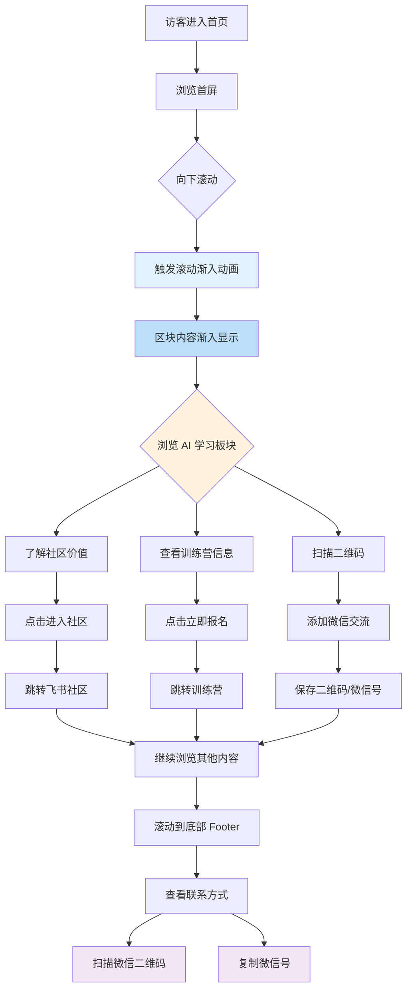

# v1.3 核心用户操作流

## 流程说明

### 主流程（Happy Path）
1. **滚动动画触发**: 访客向下滚动页面，各区块内容渐入显示
2. **AI 学习板块交互**:
   - 了解社区价值 → 点击进入社区
   - 查看训练营 → 点击立即报名
   - 扫描二维码 → 添加微信
3. **联系方式交互**: 底部扫描二维码或复制微信号

### 关键分支
- 用户可以选择进入社区、报名训练营或直接加微信
- 联系方式从公众号改为微信，降低交流门槛

### 技术要点
- 滚动动画：Intersection Observer + CSS transition
- 二维码显示：/public/wechat-qrcode.png
- 链接：Way To AGI 飞书社区
