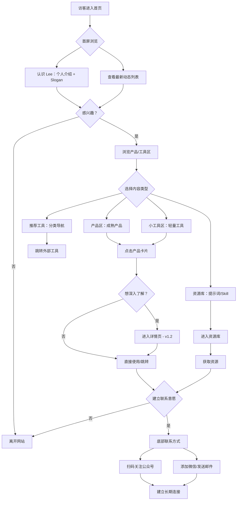

# 产品需求文档：Lee's Online 个人主页网站 - V1.0

**文档版本**: 1.0
**创建日期**: 2025-01-29
**产品状态**: 已发布
**文档作者**: Lee

---

## 1. 综述 (Overview)

### 1.1 项目背景与核心问题

**核心问题:**
AI时代，独立开发者需要一个能够建立个人品牌的线上门户。传统的作品集网站往往千篇一律、缺乏个性，无法有效传达"用代码解决生活问题"的产品哲学。

**解决方案:**
Lee's Online 是一个独立开发者个人主页网站，采用 Brutal Dark（粗野主义+暗黑极简）风格，展示自有产品/工具、推荐工具和资源库。网站定位为"个人品牌门户"，而非单纯的作品集。

**核心价值:**
- 让访客先认识"人"，再看"作品"——叙事优先的产品展示逻辑
- 区分"产品"与"小工具"两个层级，体现"从问题出发、小工具迭代成产品"的理念
- 通过推荐工具和资源库，为访客提供即时价值
- 低调展示联系方式，建立真实连接

### 1.2 核心业务流程 / 用户旅程地图

1.  **阶段一：认识 Lee** - 访客进入首页，通过个人介绍和 Slogan 理解 Lee 的产品哲学
2.  **阶段二：了解作品** - 浏览产品区和小工具区，了解 Lee 能做什么
3.  **阶段三：获取价值** - 通过推荐工具和资源库，获得即时可用价值
4.  **阶段四：建立连接** - 通过公众号或联系方式，建立长期联系

### 1.3 Mermaid 图（流程/状态/时序）

#### 1.3.1 用户操作流（必填）



---

## 2. 用户故事详述 (User Stories)

### 阶段一：认识 Lee

---

#### **US-01: 作为访客，我希望在首屏快速了解 Lee 是谁以及他在做什么，以便决定是否继续浏览。**

*   **价值陈述 (Value Statement)**:
    *   **作为** 访客
    *   **我希望** 在进入网站后立即了解站主的身份和产品理念
    *   **以便于** 判断这个网站是否值得深入探索
*   **业务规则与逻辑 (Business Logic)**:
    1.  **前置条件**: 访客通过浏览器访问网站首页
    2.  **操作流程 (Happy Path)**:
        1. 访客进入首页，首屏占据约 90vh 高度
        2. 左侧展示个人介绍：身份标签、Logo、姓名、Slogan
        3. 右侧展示"最新动态"列表：显示 4 个正在进行的项目/资源，每个带有状态标签
        4. 访客可以点击"看看我做了什么"按钮滚动到产品区
        5. 访客可以点击最新动态中的任意项目查看详情
    3.  **异常处理 (Error Handling)**: 无（静态内容无异常场景）
*   **验收标准 (Acceptance Criteria)**:
    *   **场景1: 首屏完整展示**
        *   **GIVEN** 访客使用桌面端浏览器访问首页
        *   **WHEN** 页面加载完成
        *   **THEN** 首屏应展示完整的个人介绍和最新动态，无滚动条
    *   **场景2: 移动端响应式**
        *   **GIVEN** 访客使用移动设备访问首页
        *   **WHEN** 页面加载完成
        *   **THEN** 左右两栏应上下堆叠，保持内容完整可读
*   **页面布局线框图 (ASCII Wireframe)**:
    ```text
    +--------------------------------------------------------------------------+
    |                                                                          |
    |  +----------------------------+           +----------------------------+  |
    |  | // 独立开发者              |           | // 最新动态                |  |
    |  |                            |           |                            |  |
    |  |  +----------------------+  |           |  +----------------------+  |  |
    |  |  |                      |  |           |  | 资料存储系统    LIVE |  |  |
    |  |  |         L            |  |           |  +----------------------+  |  |
    |  |  |                      |  |           |                            |  |
    |  |  +----------------------+  |           |  +----------------------+  |  |
    |  |                            |           |  | 写小说系统     WIP |  |  |
    |  |  HI, 我是 LEE              |           |  +----------------------+  |  |
    |  |                            |           |                            |  |
    |  |  用代码解决生活中的小麻烦  |           |  +----------------------+  |  |
    |  |  一个工具一个工具地做下去  |           |  | 提示词库   UPDATING |  |  |
    |  |                            |           |  +----------------------+  |  |
    |  |  [ 看看我做了什么 ↓ ]      |           |                            |  |
    |  |                            |           |  +----------------------+  |  |
    |  |                            |           |  | Skill技能库  RESOURCE|  |  |
    |  |                            |           |  +----------------------+  |  |
    |  +----------------------------+           +----------------------------+  |
    |                                                                          |
    +--------------------------------------------------------------------------+
    ```

---

### 阶段二：了解作品

---

#### **US-02: 作为访客，我希望浏览 Lee 的成熟产品，以便了解他的核心能力和作品。**

*   **价值陈述 (Value Statement)**:
    *   **作为** 访客
    *   **我希望** 看到展示成熟产品的大卡片
    *   **以便于** 快速判断 Lee 的核心技能领域和产品能力
*   **业务规则与逻辑 (Business Logic)**:
    1.  **前置条件**: 访客已浏览首屏并滚动到产品区
    2.  **操作流程 (Happy Path)**:
        1. 产品区标题显示"01 我的产品"
        2. 展示 2 列产品卡片，每个卡片包含：类型标签、年份、标题、一句话介绍、操作按钮
        3. "资料存储系统"显示蓝色边框和阴影，状态为"产品"
        4. "写小说系统"显示琥珀色边框和阴影，状态为"开发中"
        5. 访客可点击卡片跳转到产品详情页（v1.2 功能）或外部链接
    3.  **异常处理 (Error Handling)**: 无
*   **验收标准 (Acceptance Criteria)**:
    *   **场景1: 产品卡片展示**
        *   **GIVEN** 访客滚动到产品区
        *   **WHEN** 区域进入视口
        *   **THEN** 应显示 2 个产品卡片，使用大卡片样式（包含完整的标题、介绍、按钮）
    *   **场景2: 状态视觉区分**
        *   **GIVEN** 访客查看产品卡片
        *   **WHEN** 视觉扫描
        *   **THEN** "产品"状态使用蓝色、"开发中"使用琥珀色，按钮文案区分"立即使用"与"敬请期待"
*   **页面布局线框图 (ASCII Wireframe)**:
    ```text
    +--------------------------------------------------------------------------+
    | 01  我自己的产品                                          查看全部 →      |
    +--------------------------------------------------------------------------+
    |                                                                          |
    |  +--------------------------------------+    +--------------------------+ |
    |  | [产品]                        2024  |    | [开发中]               2025| |
    |  |                                    |    |                          | |
    |  |  资料存储系统                       |    |  写小说系统               | |
    |  |                                    |    |                          | |
    |  |  一句话介绍这个产品...              |    |  一句话介绍这个产品...     | |
    |  |                                    |    |                          | |
    |  |  [ 立即使用 ]  了解更多 →           |    |  [ 敬请期待 ]  了解更多 →  | |
    |  +--------------------------------------+    +--------------------------+ |
    |                                                                          |
    +--------------------------------------------------------------------------+
    ```

---

#### **US-03: 作为访客，我希望浏览 Lee 的小工具集合，以便了解他解决具体问题的思路和能力。**

*   **价值陈述 (Value Statement)**:
    *   **作为** 访客
    *   **我希望** 看到轻量级小工具的网格展示
    *   **以便于** 发现实用的工具并理解 Lee "从问题出发"的产品理念
*   **业务规则与逻辑 (Business Logic)**:
    1.  **前置条件**: 访客已浏览产品区
    2.  **操作流程 (Happy Path)**:
        1. 小工具区标题显示"02 小工具"
        2. 展示 4 列网格，前 3 个为工具卡片，第 4 个为"更多"入口
        3. 每个工具卡片包含：工具名称、简短描述
        4. 访客可点击卡片跳转到工具使用页面
    3.  **异常处理 (Error Handling)**: 无
*   **验收标准 (Acceptance Criteria)**:
    *   **场景1: 网格布局展示**
        *   **GIVEN** 访客滚动到小工具区
        *   **WHEN** 区域进入视口
        *   **THEN** 应显示 4 列网格布局，移动端响应式为 2 列
    *   **场景2: 小工具与产品区分**
        *   **GIVEN** 访客对比产品区和小工具区
        *   **WHEN** 视觉扫描
        *   **THEN** 小工具卡片明显小于产品卡片，体现"轻量"定位
*   **页面布局线框图 (ASCII Wireframe)**:
    ```text
    +--------------------------------------------------------------------------+
    | 02  小工具                                               查看全部 →      |
    +--------------------------------------------------------------------------+
    |                                                                          |
    |  +-------------+  +-------------+  +-------------+  +-------------+     |
    |  |             |  |             |  |             |  |             |     |
    |  |  工具 A     |  |  工具 B     |  |  工具 C     |  |             |     |
    |  |             |  |             |  |             |  |    更多 →   |     |
    |  |  解决某...  |  |  解决某...  |  |  解决某...  |  |             |     |
    |  |             |  |             |  |             |  |             |     |
    |  +-------------+  +-------------+  +-------------+  +-------------+     |
    |                                                                          |
    +--------------------------------------------------------------------------+
    ```

---

#### **US-04: 作为访客，我希望访问 Lee 收集的资源库（提示词库、Skill技能库），以便获取可用的资源。**

*   **价值陈述 (Value Statement)**:
    *   **作为** 访客
    *   **我希望** 能够访问 Lee 收集整理的资源库
    *   **以便于** 获得高质量的提示词和技能参考
*   **业务规则与逻辑 (Business Logic)**:
    1.  **前置条件**: 访客已浏览小工具区
    2.  **操作流程 (Happy Path)**:
        1. 资源库标题显示"03 资源库"
        2. 展示 2 列大卡片：提示词库（青色）、Skill技能库（紫色）
        3. 每个卡片包含：类型标识（// PROMPTS / // SKILLS）、标题、描述、进入链接
        4. 访客可点击卡片进入对应资源库
    3.  **异常处理 (Error Handling)**: 无
*   **验收标准 (Acceptance Criteria)**:
    *   **场景1: 资源库卡片展示**
        *   **GIVEN** 访客滚动到资源库区
        *   **WHEN** 区域进入视口
        *   **THEN** 应显示 2 个资源库卡片，使用对应主题色（青色/紫色）
    *   **场景2: 视觉层次清晰**
        *   **GIVEN** 访客浏览页面
        *   **WHEN** 对比各个区块
        *   **THEN** 资源库使用独立的区块和视觉风格，与小工具区形成区分
*   **页面布局线框图 (ASCII Wireframe)**:
    ```text
    +--------------------------------------------------------------------------+
    | 03  资源库                                                                |
    +--------------------------------------------------------------------------+
    |                                                                          |
    |  +--------------------------------------+    +--------------------------+ |
    |  | // PROMPTS                           |    | // SKILLS                | |
    |  |                                    |    |                          | |
    |  |  提示词库                            |    |  Skill 技能库             | |
    |  |                                    |    |                          | |
    |  |  收集整理的优质提示词，持续更新中   |    |  实用的技能集合...        | |
    |  |                                    |    |                          | |
    |  |  进入 →                             |    |  进入 →                   | |
    |  +--------------------------------------+    +--------------------------+ |
    |                                                                          |
    +--------------------------------------------------------------------------+
    ```

---

#### **US-05: 作为访客，我希望通过分类标签浏览 Lee 推荐的工具，以便发现对我有用的外部工具。**

*   **价值陈述 (Value Statement)**:
    *   **作为** 访客
    *   **我希望** 能够按分类浏览推荐工具
    *   **以便于** 快速找到符合我需求的外部工具
*   **业务规则与逻辑 (Business Logic)**:
    1.  **前置条件**: 访客已浏览资源库区
    2.  **操作流程 (Happy Path)**:
        1. 推荐工具区标题显示"04 推荐工具"
        2. 展示分类标签：AI工具、效率工具、开发工具、设计工具
        3. 默认选中"AI工具"标签，显示对应工具卡片
        4. 每个工具卡片包含：图标、名称、简介
        5. 访客可点击标签切换分类，点击卡片跳转到外部工具
    3.  **异常处理 (Error Handling)**: 无
*   **验收标准 (Acceptance Criteria)**:
    *   **场景1: 分类标签切换**
        *   **GIVEN** 访客在推荐工具区
        *   **WHEN** 点击不同的分类标签
        *   **THEN** 选中的标签应高亮显示，工具卡片对应更新（前端过滤）
    *   **场景2: 工具卡片展示**
        *   **GIVEN** 访客浏览推荐工具
        *   **WHEN** 查看工具卡片
        *   **THEN** 每个卡片应显示图标、名称、简短描述，点击后跳转外部链接
*   **页面布局线框图 (ASCII Wireframe)**:
    ```text
    +--------------------------------------------------------------------------+
    | 04  推荐工具                                                              |
    +--------------------------------------------------------------------------+
    |  [ AI工具 ]  效率工具  开发工具  设计工具                                  |
    +--------------------------------------------------------------------------+
    |                                                                          |
    |  +-------------+  +-------------+  +-------------+  +-------------+     |
    |  | ┌─────┐     |  | ┌─────┐     |  | ┌─────┐     |  |             |     |
    |  │ │  C  │     |  | │ Cu  │     |  | │  N  │     |  |             |     |
    |  | └─────┘     |  | └─────┘     |  | └─────┘     |  |    更多 →   |     |
    |  |  Claude     |  |  Cursor     |  |  Notion     |  |             |     |
    |  |  AI 助手    |  |  AI 编辑器  |  |  笔记协作   |  |             |     |
    |  +-------------+  +-------------+  +-------------+  +-------------+     |
    |                                                                          |
    +--------------------------------------------------------------------------+
    ```

---

### 阶段三：全局交互

---

#### **US-06: 作为访客，我希望能够切换深色/浅色主题，以便适应我的阅读偏好。**

*   **价值陈述 (Value Statement)**:
    *   **作为** 访客
    *   **我希望** 能够在深色和浅色主题之间切换
    *   **以便于** 根据环境光线和个人偏好选择舒适的显示模式
*   **业务规则与逻辑 (Business Logic)**:
    1.  **前置条件**: 访客已进入网站任意页面
    2.  **操作流程 (Happy Path)**:
        1. 右上角显示主题切换按钮
        2. 深色模式下显示"浅色"标签和太阳图标
        3. 浅色模式下显示"深色"标签和月亮图标
        4. 点击按钮切换主题，页面立即响应
        5. 主题偏好保存到 localStorage，刷新页面后保持
    3.  **异常处理 (Error Handling)**: localStorage 不可用时降级为会话级别存储
*   **验收标准 (Acceptance Criteria)**:
    *   **场景1: 主题切换**
        *   **GIVEN** 访客在深色模式下浏览网站
        *   **WHEN** 点击主题切换按钮
        *   **THEN** 页面应切换到浅色模式，按钮更新为"深色"标签和月亮图标
    *   **场景2: 偏好持久化**
        *   **GIVEN** 访客切换到浅色模式
        *   **WHEN** 刷新页面
        *   **THEN** 页面应保持浅色模式
*   **页面布局线框图 (ASCII Wireframe)**:
    ```text
    +--------------------------------------------------------------------------+
    | LEE'S ONLINE                                       [ ☀ 浅色 ]           |
    +--------------------------------------------------------------------------+
    |  产品   工具   推荐   关于                                                   |
    +--------------------------------------------------------------------------+
    ```
    > 主题切换按钮固定在右上角，滚动时保持可见

---

#### **US-07: 作为访客，我希望能够通过底部联系方式与 Lee 建立连接，以便进行进一步沟通。**

*   **价值陈述 (Value Statement)**:
    *   **作为** 访客
    *   **我希望** 能够找到 Lee 的联系方式
    *   **以便于** 咨询合作、反馈问题或建立联系
*   **业务规则与逻辑 (Business Logic)**:
    1.  **前置条件**: 访客已浏览完整页面
    2.  **操作流程 (Happy Path)**:
        1. 底部显示两列布局：左侧公众号二维码、右侧联系方式
        2. 公众号区块显示：标签、二维码占位、提示文案
        3. 联系方式区块显示：微信号码、邮箱地址
        4. 访客可扫码关注公众号或复制联系方式
    3.  **异常处理 (Error Handling)**: 无
*   **验收标准 (Acceptance Criteria)**:
    *   **场景1: 联系方式展示**
        *   **GIVEN** 访客滚动到页面底部
        *   **WHEN** 查看底部区域
        *   **THEN** 应显示公众号二维码占位和联系方式（微信、邮箱）
    *   **场景2: 移动端响应式**
        *   **GIVEN** 访客使用移动设备
        *   **WHEN** 查看底部
        *   **THEN** 两列应上下堆叠，保持内容可读
*   **页面布局线框图 (ASCII Wireframe)**:
    ```text
    +--------------------------------------------------------------------------+
    |                                                                          |
    |  +---------------------------+        +---------------------------+     |
    |  | // 关注公众号             |        | // 联系方式               |     |
    |  |                           |        |                           |     |
    |  |    ┌─────────┐            |        |  微信：18559693218        |     |
    |  |    │         │            |        |                           |     |
    |  |    │  QR码   │            |        |  邮箱：287796033@qq.com   |     |
    |  |    │         │            |        |                           |     |
    |  |    └─────────┘            |        |  ───────────────────────  |     |
    |  |                           |        |                           |     |
    |  |  获取更多内容             |        |  © 2025 LEE'S ONLINE      |     |
    |  +---------------------------+        +---------------------------+     |
    |                                                                          |
    +--------------------------------------------------------------------------+
    ```

---

#### **US-08: 作为访客，我希望通过顶部导航快速跳转到各个区块，以便高效浏览感兴趣的内容。**

*   **价值陈述 (Value Statement)**:
    *   **作为** 访客
    *   **我希望** 能够通过导航链接快速跳转到页面各区块
    *   **以便于** 高效浏览我感兴趣的内容
*   **业务规则与逻辑 (Business Logic)**:
    1.  **前置条件**: 访客已进入网站
    2.  **操作流程 (Happy Path)**:
        1. 顶部导航栏固定显示：品牌名、导航链接
        2. 导航链接：产品(#work)、工具(#tools)、推荐(#recommended)、关于(#about)
        3. 点击链接平滑滚动到对应区块
        4. 当前区块高亮显示（可选优化）
    3.  **异常处理 (Error Handling)**: 无
*   **验收标准 (Acceptance Criteria)**:
    *   **场景1: 导航跳转**
        *   **GIVEN** 访客在页面顶部
        *   **WHEN** 点击"产品"导航链接
        *   **THEN** 页面应平滑滚动到产品区顶部
    *   **场景2: 移动端导航**
        *   **GIVEN** 访客使用移动设备
        *   **WHEN** 查看导航栏
        *   **THEN** 导航链接应保持可见，可点击跳转
*   **页面布局线框图 (ASCII Wireframe)**:
    ```text
    +--------------------------------------------------------------------------+
    | LEE'S ONLINE                                                 [ ☀ 浅色 ]  |
    +--------------------------------------------------------------------------+
    |  产品   工具   推荐   关于                                                   |
    +--------------------------------------------------------------------------+
    ```
    > 导航栏使用页面内锚点（#work, #tools, #recommended, #about）

---

## 3. 非功能需求 (Non-Functional Requirements)

### 3.1 性能要求
- **首屏加载时间**: < 2s（4G 网络）
- **交互响应时间**: < 100ms（主题切换、滚动等）
- **静态资源优化**: 图片使用 WebP 格式，启用 CDN 加速

### 3.2 SEO 要求
- **页面标题**: "Lee's Online - 独立开发者作品集"
- **Meta 描述**: "Lee.dev - 独立开发者作品集，分享产品、工具和资源，用代码解决生活中的小麻烦"
- **结构化数据**: 包含 Person 和 WebSite 类型的 JSON-LD
- **Open Graph**: 完整的 og:title, og:description, og:image, og:url
- **Sitemap**: 已生成 `public/sitemap.xml`

### 3.3 可访问性 (A11y)
- **语义化 HTML**: 使用正确的 heading 层级、nav/footer 等语义标签
- **ARIA 标签**: 按钮添加 aria-label，导航添加 aria-label
- **键盘导航**: 支持 Tab 键导航和 Enter 键激活
- **对比度**: 深色/浅色模式下文本对比度符合 WCAG AA 标准

### 3.4 浏览器兼容性
- **现代浏览器**: Chrome/Edge 最新版、Firefox 最新版、Safari 最新版
- **移动浏览器**: iOS Safari 14+、Android Chrome 90+

---

## 4. 技术栈说明

### 4.1 前端框架
- **React 19.1.1**: UI 框架
- **Vite 6.4.1**: 构建工具
- **TypeScript 5.9.2**: 类型安全

### 4.2 UI 组件库
- **shadcn/ui**: 基于 Radix UI 的无样式组件
- **Tailwind CSS 3.4.17**: 原子化 CSS 框架
- **Lucide React**: 图标库

### 4.3 状态管理
- **React Hooks**: useState, useEffect
- **next-themes**: 主题切换

### 4.4 路由
- **React Router DOM 7.8.2**: 客户端路由（v1.0 为单页，为后续版本预留）

---

## 5. 风格与设计规范

### 5.1 设计风格
- **风格名称**: Brutal Dark（粗野主义 + 暗黑极简）
- **核心元素**: 硬边框（border-2）、块状阴影（shadow-brutal）、大胆排版、mono 字体

### 5.2 配色方案

**深色模式（默认）:**
- 背景: `#0a0a0a` / `#171717`
- 前景: `#fafafa` / `#a1a1aa`
- 主色: `#3b82f6` (蓝色)
- 边框: `#262626` / `#404040`

**浅色模式:**
- 背景: `#fafafa` / `#ffffff`
- 前景: `#0a0a0a` / `#52525b`
- 主色: `#2563eb` (蓝色)
- 边框: `#e5e5e5` / `#d4d4d8`

### 5.3 状态颜色
- LIVE（已上线）: 主色蓝色
- WIP（开发中）: 琥珀色 `#f59e0b`
- UPDATING（更新中）: 青色 `#06b6d4`
- RESOURCE（资源）: 紫色 `#a855f7`

### 5.4 字体
- **Mono 字体**: 用于标签、小标题、元数据
- **Sans 字体**: 用于正文、标题

---

## 6. 版本规划

### 6.1 已完成版本

| 版本 | 发布日期 | 主要功能 |
|------|----------|----------|
| v1.0 | 2025-01-29 | MVP 基础版本：首屏、产品区、小工具区、资源库、推荐工具、主题切换、底部 |

### 6.2 后续版本规划

| 版本 | 功能 | 优先级 | 预计发布 |
|------|------|--------|----------|
| v1.1 | 关于我页面（详细个人介绍、经历、故事） | 中 | 待定 |
| v1.2 | 作品详情页（每个产品单独介绍页） | 中 | 待定 |
| v1.3 | 搜索功能（工具多了之后） | 低 | 待定 |
| v1.4 | RSS/订阅（让别人订阅更新） | 低 | 待定 |
| v1.5 | 多语言支持（英文版） | 低 | 待定 |

---

## 7. 数据结构（预留）

### 7.1 产品/工具数据结构（为后续 CMS 预留）

```typescript
interface Product {
  id: string;
  title: string;
  description: string;
  type: 'product' | 'tool';
  status: 'live' | 'wip' | 'updating';
  year: number;
  url?: string;
  cover?: string;
  tags?: string[];
}

interface Resource {
  id: string;
  title: string;
  description: string;
  type: 'prompts' | 'skills';
  color: 'cyan' | 'purple';
  url?: string;
}
```

### 7.2 推荐工具数据结构

```typescript
interface RecommendedTool {
  id: string;
  name: string;
  description: string;
  category: 'ai' | 'efficiency' | 'dev' | 'design';
  icon: string;
  url: string;
}
```

---

## 8. 附录

### 8.1 项目仓库
- **GitHub**: 待添加
- **在线预览**: 待部署

### 8.2 联系方式
- **微信**: 18559693218
- **邮箱**: 287796033@qq.com

### 8.3 文档变更记录

| 版本 | 日期 | 变更内容 | 作者 |
|------|------|----------|------|
| 1.0 | 2025-01-29 | 初始版本，v1.0 PRD | Lee |

---

**文档结束**
