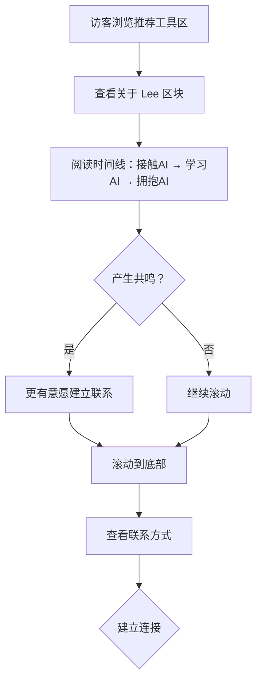

# 产品需求文档：Lee's Online 个人主页网站 - V1.1

**文档版本**: 1.1
**创建日期**: 2025-01-29
**更新日期**: 2025-01-30
**产品状态**: 已开发
**父版本**: v1.0
**文档作者**: Lee

---

## 1. 综述 (Overview)

### 1.1 版本概述

**v1.1 是 v1.0 的首次迭代版本**，核心目标是增强个人品牌展示和用户体验交互。

**实际实现变更：**
1. **首屏重新设计**：左边个人简介 + 右边关于 Lee 时间线 + 下方最新动态
2. 产品名称更新："资料存储系统" → "拾光"
3. 为产品、推荐工具添加实际跳转链接
4. 优化卡片 hover 视觉反馈
5. 添加页面滚动进度指示
6. 为 v1.2 作品详情页做功能预告
7. **推荐工具重新设计**：开发工具分类优先、7个工具卡片 + 更多入口

### 1.2 核心业务流程 / 用户旅程地图

1.  **阶段一：认识 Lee** - 访客进入首页，通过个人简介 + 关于 Lee 时间线完整理解 Lee 的故事
2.  **阶段二：了解作品** - 浏览产品区和小工具区，了解 Lee 能做什么
3.  **阶段三：获取价值** - 通过推荐工具和资源库，获得即时可用价值
4.  **阶段四：建立连接** - 通过公众号或联系方式，建立长期联系

### 1.3 Mermaid 图（流程/状态/时序）

#### 1.3.1 用户操作流（v1.1 变更部分）



---

## 2. 用户故事详述 (User Stories)

### 阶段一：认识 Lee（v1.1 重新设计）

---

#### **US-09: 作为访客，我希望在首屏同时看到 Lee 的个人介绍和 AI 故事，以便完整了解他是谁。**

*   **价值陈述 (Value Statement)**:
    *   **作为** 访客
    *   **我希望** 能够在首屏同时了解 Lee 的个人简介和与 AI 的故事历程
    *   **以便于** 完整理解 Lee 的背景、动机和价值观
*   **业务规则与逻辑 (Business Logic)**:
    1.  **前置条件**: 访客进入网站首页
    2.  **操作流程 (Happy Path)**:
        1. 首屏采用左右分栏布局：
           - **左边（50%）**：个人简介（Logo、"我是 LEE"、Slogan、CTA 按钮）
           - **右边（50%）**：关于 Lee 时间线（3个节点）
        2. 首屏下方：最新动态横向网格（4列）
        3. 时间线内容：2025·初（接触）、2025·6月（震撼与焦虑）、现在（拥抱）
        4. **正式文案内容**：
           - **2025·初**: 那个夜晚，我第一次和 AI 对话 / 屏幕上的字，像一道光 / 我意识到，世界已经不一样了
           - **2025·6月**: 沉浸其中，无法自拔 / 深深震撼，深深焦虑 / AI 奔跑太快 / 我怕被时代抛下
           - **现在**: 迷雾散去，答案浮现 / AI 不会取代我们 / 它会让真正会用它的人，变得无可替代 / 我是 Lee，一个程序员 / 用代码 + AI，写下自己的序章
    3.  **异常处理 (Error Handling)**: 无（静态内容）
*   **验收标准 (Acceptance Criteria)**:
    *   **场景1: 首屏布局展示**
        *   **GIVEN** 访客进入首页
        *   **WHEN** 页面加载完成
        *   **THEN** 应显示左右分栏布局（个人简介 + 时间线）+ 下方最新动态
    *   **场景2: 移动端响应式**
        *   **GIVEN** 访客使用移动设备
        *   **WHEN** 查看首屏
        *   **THEN** 左右两栏应上下堆叠，保持内容完整可读
*   **页面布局线框图 (ASCII Wireframe)**:
    ```text
    +--------------------------------------------------------------------------+
    |  [左边 50%]                   [右边 50%]                             |
    |                                                                      |
    |  ┌───┐                        // ABOUT LEE                            |
    |  │ L │                        关于我                                   |
    |  └───┘                                                               |
    |  HI, 我是 LEE                2025·初  ◄───                             |
    |                                                                      |
    |  用代码解决...               那个夜晚...                                |
    |  一个工具一个                                                        |
    |  工具地做下去                 2025·6月  ◄───                             |
    |                                                                      |
    |  [看看我做了什么 ↓]         深深震撼...                                 |
    |                             现在  ◄───                                 |
    |                             迷雾散去...                                 |
    +--------------------------------------------------------------------------+
    |  // 最新动态                                                          |
    |  [拾光] [写小说系统] [提示词库] [Skill技能库]                             |
    +--------------------------------------------------------------------------+
    ```

---

### 阶段二：链接与交互（v1.1 新增）

---

#### **US-10: 作为访客，我希望点击产品/推荐工具卡片时能跳转到实际链接，以便使用或了解更多。**

*   **价值陈述 (Value Statement)**:
    *   **作为** 访客
    *   **我希望** 卡片链接能够正常跳转
    *   **以便于** 访问实际的产品、资源或工具官网
*   **业务规则与逻辑 (Business Logic)**:
    1.  **前置条件**: 访客浏览产品区/推荐工具区
    2.  **操作流程 (Happy Path)**:
        1. **产品区**：
           - "拾光"（资料存储系统改名）：点击跳转到外部链接 `https://277078962e8c471691f9db87fae77eb3.prod.enter.pro/`
           - "写小说系统"：开发中，无链接，点击无响应
        2. **推荐工具**（开发工具分类默认选中）：
           - Claude Code → Anthropic Docs
           - Codex → ChatGPT (`https://chatgpt.com/`)
           - Enter.pro → `https://enter.pro`
           - GitHub → `https://github.com`
           - Cursor → `https://cursor.sh`
           - Trae → `https://trae.cn`
           - Codebuddy → `https://copilot.tencent.com/`
           - 更多：暂无链接
        3. 外部链接在新标签页打开（`target="_blank"` + `rel="noopener noreferrer"`）
    3.  **异常处理 (Error Handling)**:
        - 如果链接配置为空，点击无响应（不报错）
*   **验收标准 (Acceptance Criteria)**:
    *   **场景1: 产品链接跳转**
        *   **GIVEN** 访客点击"拾光"产品卡片
        *   **WHEN** 点击完成
        *   **THEN** 应在新标签页打开外部链接
    *   **场景2: 推荐工具跳转**
        *   **GIVEN** 访客点击"Claude Code"卡片
        *   **WHEN** 点击完成
        *   **THEN** 应在新标签页打开 Anthropic Docs
*   **页面布局线框图 (ASCII Wireframe)**:
    ```text
    无需线框图，此故事为功能增强，不改变布局
    ```

---

#### **US-11: 作为访客，我希望卡片 hover 时有明显的视觉反馈，以便确认当前选中的内容。**

*   **价值陈述 (Value Statement)**:
    *   **作为** 访客
    *   **我希望** 卡片 hover 时有清晰的视觉变化
    *   **以便于** 快速识别当前鼠标位置和可点击元素
*   **业务规则与逻辑 (Business Logic)**:
    1.  **前置条件**: 访客使用鼠标浏览页面
    2.  **操作流程 (Happy Path)**:
        1. 鼠标悬停在任何卡片上（产品、小工具、资源库、推荐工具）
        2. 卡片触发以下视觉变化：
           - 边框颜色变为主色（蓝色/对应主题色）
           - 背景色略微变深（`hover:bg-primary/5`）
           - 阴影增强（`shadow-brutal-lg`）
           - 文字颜色变化（标题变为主色）
        3. 鼠标移出后恢复原状
    3.  **异常处理 (Error Handling)**: 无
*   **验收标准 (Acceptance Criteria)**:
    *   **场景1: 产品卡片 hover**
        *   **GIVEN** 访客浏览产品区
        *   **WHEN** 鼠标悬停在"拾光"卡片上
        *   **THEN** 卡片边框变蓝色、背景色变深、阴影增强、标题变蓝色
    *   **场景2: 移动端点击反馈**
        *   **GIVEN** 访客使用移动设备
        *   **WHEN** 点击卡片
        *   **THEN** 应有短暂的视觉反馈（如点击态高亮）
*   **页面布局线框图 (ASCII Wireframe)**:
    ```text
    无需线框图，此故事为交互优化

    Hover 效果说明：
    - 边框：border-neutral-200 → border-primary
    - 背景：bg-neutral-50 → hover:bg-primary/5
    - 阴影：shadow-brutal → shadow-brutal-lg
    - 标题：text-foreground → text-primary
    ```

---

#### **US-12: 作为访客，我希望顶部有阅读进度指示，以便了解当前滚动位置。**

*   **价值陈述 (Value Statement)**:
    *   **作为** 访客
    *   **我希望** 能够看到页面阅读进度
    *   **以便于** 了解页面长度和当前位置
*   **业务规则与逻辑 (Business Logic)**:
    1.  **前置条件**: 访客进入首页并开始滚动
    2.  **操作流程 (Happy Path)**:
        1. 页面顶部（导航栏上方）显示一条细进度条
        2. 进度条颜色为主色（蓝色）
        3. 进度条宽度随滚动位置动态变化（0% - 100%）
        4. 进度条固定在顶部，滚动时始终可见
    3.  **异常处理 (Error Handling)**: 无
*   **验收标准 (Acceptance Criteria)**:
    *   **场景1: 进度条显示**
        *   **GIVEN** 访客进入首页
        *   **WHEN** 开始向下滚动
        *   **THEN** 顶部应显示蓝色进度条，宽度随滚动增加
    *   **场景2: 滚动到底部**
        *   **GIVEN** 访客滚动到页面底部
        *   **WHEN** 查看进度条
        *   **THEN** 进度条应接近 100% 宽度
*   **页面布局线框图 (ASCII Wireframe)**:
    ```text
    +==========================================================================+
    = 进度条（随滚动从 0% 到 100%）                                             =
    +==========================================================================+
    | LEE'S ONLINE                                                 [ ☀ 浅色 ]  |
    +--------------------------------------------------------------------------+
    |  产品   工具   推荐   关于                                                   |
    +--------------------------------------------------------------------------+
    ```
    > 进度条高度：3px，固定在页面最顶部

---

#### **US-13: 作为访客，我希望在产品卡片上看到"详情"按钮，了解后续有详情页可看。**

*   **价值陈述 (Value Statement)**:
    *   **作为** 访客
    *   **我希望** 产品卡片提示有详情页功能
    *   **以便于** 知道后续可以深入了解产品（v1.2 功能预告）
*   **业务规则与逻辑 (Business Logic)**:
    1.  **前置条件**: 访客浏览产品区
    2.  **操作流程 (Happy Path)**:
        1. 产品卡片原有按钮："[ 立即使用 ]" 和 "了解更多 →"
        2. 鼠标 hover 时，在卡片右上角浮现提示："详情页即将推出"
        3. 点击时不做跳转（为 v1.2 做铺垫）
    3.  **异常处理 (Error Handling)**: 无
*   **验收标准 (Acceptance Criteria)**:
    *   **场景1: Hover 提示显示**
        *   **GIVEN** 访客浏览产品区
        *   **WHEN** 鼠标 hover 在"拾光"卡片上
        *   **THEN** 应显示"详情页即将推出"提示
    *   **场景2: 非开发中产品**
        *   **GIVEN** 访客查看"写小说系统"卡片
        *   **WHEN** 鼠标 hover
        *   **THEN** 不显示"详情页即将推出"（因为本身就是"敬请期待"状态）
*   **页面布局线框图 (ASCII Wireframe)**:
    ```text
    无需线框图，此故事为交互优化

    详情页预告说明：
    - 位置：卡片右上角
    - 触发：hover 显示
    - 文案："详情页即将推出"
    ```

---

#### **US-14: 作为访客，我希望推荐工具区展示开发工具为主，以便快速找到开发相关的工具。**

*   **价值陈述 (Value Statement)**:
    *   **作为** 访客（开发者）
    *   **我希望** 推荐工具区默认展示开发工具分类
    *   **以便于** 快速找到开发相关的工具推荐
*   **业务规则与逻辑 (Business Logic)**:
    1.  **前置条件**: 访客滚动到推荐工具区
    2.  **操作流程 (Happy Path)**:
        1. 分类标签顺序：开发工具（第一个，默认选中）、AI工具、效率工具、设计工具
        2. 工具卡片布局：2行4列，共8个卡片（7个工具 + 1个"更多"）
        3. 工具列表：
           - Claude Code（CLI 开发工具）→ Anthropic Docs
           - Codex（CLI 开发工具）→ ChatGPT
           - Enter.pro（低代码平台）→ enter.pro
           - GitHub（代码管理平台）→ github.com
           - Cursor（IDE 工具）→ cursor.sh
           - Trae（IDE 工具）→ trae.cn
           - Codebuddy（IDE 工具）→ copilot.tencent.com
           - 更多（暂无链接）
        4. 每个卡片包含：图标缩写、名称、类型描述
    3.  **异常处理 (Error Handling)**: 无
*   **验收标准 (Acceptance Criteria)**:
    *   **场景1: 分类标签顺序**
        *   **GIVEN** 访客查看推荐工具区
        *   **WHEN** 查看分类标签
        *   **THEN** 第一个标签应为"开发工具"，且默认选中状态
    *   **场景2: 工具卡片数量**
        *   **GIVEN** 访客查看工具卡片
        *   **WHEN** 计数
        *   **THEN** 应显示 8 个卡片（7个工具 + 1个"更多"）
*   **页面布局线框图 (ASCII Wireframe)**:
    ```text
    +--------------------------------------------------------------------------+
    | 04  推荐工具                                                              |
    +--------------------------------------------------------------------------+
    |  [ 开发工具 ]  AI工具  效率工具  设计工具                                  |
    +--------------------------------------------------------------------------+
    |                                                                          |
    |  [CC]          [Cx]          [En]          [GH]                         |
    | Claude Code    Codex         Enter.pro    GitHub                        |
    | CLI 开发工具   CLI 开发工具   低代码平台   代码管理平台                   |
    |                                                                          |
    |  [Cu]          [Tr]          [Cb]          [更多 →]                      |
    | Cursor         Trae          Codebuddy                                  |
    | IDE 工具       IDE 工具       IDE 工具                                   |
    |                                                                          |
    +--------------------------------------------------------------------------+
    ```
    |                                                                          |
    |    现在  ◄──────────────────────────────────────────────────────────     |
    |    迷雾散去，答案浮现                                                     |
    |    AI 不会取代我们 / 它会让真正会用它的人，变得无可替代                   |
    |    我是 Lee，一个程序员 / 用代码 + AI，在这个时代写下自己的序章            |
    |                                                                          |
    +--------------------------------------------------------------------------+
    ```

## 3. 变更影响分析

### 3.1 数据结构变更

**新增配置项：**

```typescript
// 产品链接配置
interface ProductLinks {
  shiguang: string;  // 拾光（资料存储系统）外部链接
  novel?: string;     // 写小说系统（暂无）
}

// 推荐工具链接配置
interface RecommendedToolLinks {
  claude: string;        // https://claude.ai
  claudeCode: string;    // Anthropic Docs
  codex: string;         // https://chatgpt.com
  cursor: string;        // https://cursor.sh
  notion: string;        // https://notion.so
  github: string;        // https://github.com
  enter: string;         // https://enter.pro
  trae: string;          // https://trae.cn
  codebuddy: string;     // https://copilot.tencent.com
}

// 关于 Lee 内容（硬编码，暂无需 CMS）
const aboutLeeContent = {
  timeline: [
    {
      year: "2025 · 初",
      lines: [
        "那个夜晚，我第一次和 AI 对话",
        "屏幕上的字，像一道光",
        "我意识到，世界已经不一样了"
      ]
    },
    {
      year: "2025 · 6月",
      lines: [
        "沉浸其中，无法自拔",
        "深深震撼，深深焦虑",
        "AI 奔跑的速度太快",
        "我怕被时代抛下，怕自己变得多余"
      ]
    },
    {
      year: "现在",
      lines: [
        "迷雾散去，答案浮现",
        "AI 不会取代我们",
        "它会让真正会用它的人，变得无可替代",
        "我是 Lee，一个程序员",
        "用代码 + AI，在这个时代写下自己的序章"
      ]
    }
  ]
};
```

### 3.2 页面结构变更

**变更前：**
```
首屏（个人简介 + 最新动态） → 产品区 → 小工具区 → 资源库 → 推荐工具 → 底部
```

**变更后：**
```
首屏（个人简介 + 关于 Lee 时间线 + 最新动态） → 产品区 → 小工具区 → 资源库 → 推荐工具（重新设计） → 底部
                                                           ↑
                                                    进度条（顶部固定）
```

### 3.3 样式变更

**新增样式类：**
- `.progress-bar`: 进度条容器
- `.timeline-node`: 时间线节点
- `.timeline-line`: 时间线连接线
- `.hover-enhanced`: 增强 hover 效果

---

## 4. 非功能需求 (Non-Functional Requirements)

### 4.1 性能要求
- **进度条更新**: 使用 `requestAnimationFrame` 优化滚动监听
- **链接跳转**: 外部链接使用 `rel="noopener noreferrer"` 确保安全

### 4.2 可访问性 (A11y)
- **进度条**: 使用 `role="progressbar"` 和 `aria-valuenow`
- **hover 提示**: 使用 `aria-label` 或 `title` 属性提供替代文本

### 4.3 浏览器兼容性
- 与 v1.0 保持一致

---

## 5. 版本对比

| 功能 | v1.0 | v1.1 实际实现 |
|------|------|-------------|
| 首屏 | 个人简介 + 最新动态 | **重新设计：个人简介 + 关于 Lee 时间线 + 最新动态** |
| 产品区 | 资料存储系统 | **改名为"拾光"，新增链接跳转、详情页预告** |
| 小工具区 | ✓ | 无变更 |
| 资源库 | ✓ | 无变更 |
| 推荐工具 | 4个工具 | **重新设计：开发工具优先、7个工具 + 更多、新增链接** |
| 关于 Lee | ✗ | **✓ 合并到首屏** |
| 进度条 | ✗ | **✓ 新增顶部进度条** |
| Hover 效果 | 基础 | **✓ 优化增强** |
| 主题切换 | ✓ | 无变更 |
| 底部 | ✓ | 无变更 |

---

## 6. 开发任务清单

- [x] **US-09**: 首屏重新设计（个人简介 + 关于 Lee 时间线 + 最新动态）
  - [x] 左右分栏布局实现
  - [x] 时间线样式与字体优化
  - [x] 响应式布局适配
  - [x] 内容文案定稿

- [x] **US-10**: 配置链接跳转
  - [x] "拾光"产品链接配置
  - [x] 推荐工具链接配置（7个工具）
  - [x] 新标签页打开配置

- [x] **US-11**: 优化卡片 hover 效果
  - [x] 产品卡片 hover 增强
  - [x] 小工具/资源库/推荐工具卡片 hover 增强
  - [x] 移动端点击反馈

- [x] **US-12**: 实现滚动进度条
  - [x] 进度条组件开发
  - [x] 滚动监听与百分比计算
  - [x] 性能优化（requestAnimationFrame）

- [x] **US-13**: 添加详情页预告
  - [x] Hover 提示实现

- [x] **US-14**: 推荐工具重新设计
  - [x] 分类标签顺序调整（开发工具优先）
  - [x] 工具卡片更新（7个工具 + 更多）
  - [x] 工具链接配置

---

## 7. 测试验收

### 7.1 功能测试

| 测试项 | 测试步骤 | 预期结果 | 状态 |
|--------|----------|----------|------|
| 首屏布局 | 进入首页 | 显示个人简介 + 关于 Lee 时间线 + 最新动态 | ✓ |
| 时间线字体 | 查看右侧时间线 | 关键内容加粗放大（"那个夜晚"、"深深震撼"、"AI 不会取代我们"） | ✓ |
| 链接跳转 | 点击"拾光"卡片 | 新标签页打开外部链接 | ✓ |
| 链接跳转 | 点击"写小说系统"卡片 | 无跳转 | ✓ |
| 推荐工具 | 查看推荐工具区 | 开发工具分类默认选中，显示7个工具 + 更多 | ✓ |
| 推荐工具链接 | 点击 Claude Code 卡片 | 新标签页打开 Anthropic Docs | ✓ |
| 推荐工具链接 | 点击 Codex 卡片 | 新标签页打开 ChatGPT | ✓ |
| 推荐工具链接 | 点击 Enter.pro 卡片 | 新标签页打开 enter.pro | ✓ |
| 推荐工具链接 | 点击 GitHub 卡片 | 新标签页打开 github.com | ✓ |
| 推荐工具链接 | 点击 Cursor 卡片 | 新标签页打开 cursor.sh | ✓ |
| 推荐工具链接 | 点击 Trae 卡片 | 新标签页打开 trae.cn | ✓ |
| 推荐工具链接 | 点击 Codebuddy 卡片 | 新标签页打开 copilot.tencent.com | ✓ |
| Hover 效果 | 鼠标 hover 产品卡片 | 边框/背景/阴影/文字变化 | ✓ |
| 进度条 | 滚动页面 | 进度条宽度随滚动变化 | ✓ |
| 详情页预告 | Hover "拾光"卡片 | 显示"详情页即将推出" | ✓ |

### 7.2 兼容性测试

- [x] Chrome/Edge 最新版
- [x] Firefox 最新版
- [x] Safari 最新版
- [x] iOS Safari 14+
- [ ] Android Chrome 90+

### 7.3 性能测试

- [ ] 滚动性能：进度条更新不卡顿
- [ ] Hover 响应时间：< 50ms

---

## 8. 后续版本预告

### v1.2（已规划）
- 作品详情页：每个产品的独立介绍页

### v1.3-v1.5
- 搜索功能、RSS订阅、多语言支持

---

## 9. 附录

### 9.1 链接配置示例

```typescript
// config/links.ts
export const productLinks = {
  shiguang: 'https://shiguang.example.com', // 用户配置
  // novel: null // 开发中
};

export const recommendedToolLinks = {
  claude: 'https://claude.ai',
  cursor: 'https://cursor.sh',
  notion: 'https://notion.so',
};
```

### 9.2 文档变更记录

| 版本 | 日期 | 变更内容 | 作者 |
|------|------|----------|------|
| 1.1 | 2025-01-29 | v1.1 迭代 PRD：关于 Lee 区块、链接跳转、hover 优化、进度条、详情页预告 | Lee |

---

**文档结束**
