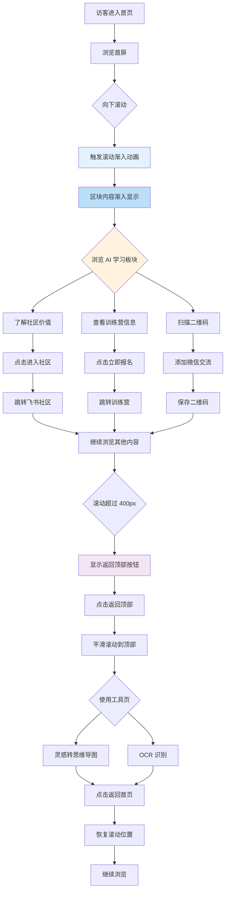
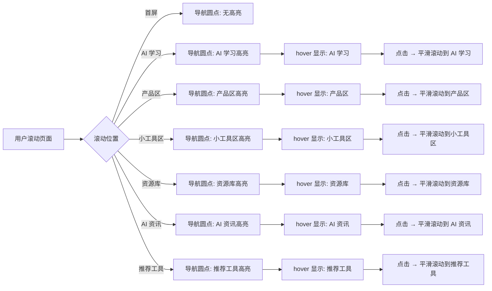

# 产品需求文档：Lee's Online 个人主页网站 - V1.3

**文档版本**: 1.3
**创建日期**: 2025-01-31
**产品状态**: 待开发
**父版本**: v1.2
**文档作者**: Lee
**最后更新**: 2025-01-31

---

## 变更日志 (Changelog)

### 2025-01-31
- ✅ **新增：滚动动画优化**
  - 页面滚动渐入动画（Scroll Reveal）
  - 固定右侧导航（7个圆点）
  - 浮动返回顶部按钮
  - 滚动位置保持（从工具页返回时）

- ✅ **新增：AI 学习板块**
  - 位置：首屏之后
  - 宣传 Way To AGI 社区和第四期训练营
  - 左侧 40%（卡片）/ 右侧 60%（介绍+特性）
  - 3个优化后的特性卡片文案

- ✅ **更新：联系方式**
  - 移除公众号相关内容
  - 保留微信二维码 + 邮箱

**当前进度**: v1.2 已完成（71%，准备开始 v1.3 开发）

---

## 1. 综述 (Overview)

### 1.1 版本概述

**v1.3 是 v1.2 的体验优化版本**，核心目标是提升用户浏览体验和增加 AI 学习板块的推广。

**核心变更：**
1. **全局滚动动画**：页面滚动时区块内容渐入显示
2. **固定导航系统**：右侧固定圆点导航，快速跳转区块
3. **返回顶部功能**：浮动按钮 + 平滑滚动
4. **位置保持**：从工具页返回时恢复滚动位置
5. **AI 学习板块**：宣传 Way To AGI 社区和第四期训练营
6. **联系方式优化**：公众号 → 微信二维码 + 邮箱

### 1.2 核心业务流程 / 用户旅程地图

1. **阶段一：视觉体验优化** → 全局滚动渐入动画
2. **阶段二：AI 学习板块** → 了解社区价值 → 加入社区/报名/加微信
3. **阶段三：联系方式优化** → 更便捷的个人联系

### 1.3 Mermaid 图（流程/状态/时序）

#### 1.3.1 用户操作流（v1.3 变更部分）



#### 1.3.2 固定导航交互流程



---

## 2. 用户故事详述 (User Stories)

---

### 阶段一：视觉体验优化（v1.3 新增）

---

#### **US-01: 滚动动画优化与导航系统**

*   **价值陈述 (Value Statement)**:
    *   **作为** 访客
    *   **我希望** 浏览页面时能看到流畅的渐入动画效果，并能快速导航到各个区块
    *   **以便于** 获得更现代、更流畅的浏览体验

*   **业务规则与逻辑 (Business Logic)**:
    1.  **前置条件**: 访客在首页
    2.  **操作流程 (Happy Path)**:
        *   **滚动渐入动画**:
            - 访客向下滚动页面
            - 元素进入视口 10% 时触发动画
            - 动画效果：opacity 0→1，translateY 30px→0
            - 过渡时间：0.8s，缓动函数：cubic-bezier(0.16, 1, 0.3, 1)
        *   **固定导航**:
            - 右侧固定显示 7 个圆点（竖向排列）
            - 点击圆点平滑滚动到对应区块
            - 当前区块圆点高亮（primary 颜色 + 放大）
        *   **返回顶部按钮**:
            - 滚动超过 400px 后，右下角显示浮动按钮
            - 点击按钮平滑滚动到顶部
            - 到达顶部后按钮自动消失
        *   **位置保持**:
            - 从首页进入工具页时，使用 sessionStorage 记录滚动位置
            - 返回首页时，自动恢复到之前的位置

    3.  **技术实现**:
        ```css
        /* 滚动渐入动画 */
        .reveal-on-scroll {
          opacity: 0;
          transform: translateY(30px);
          transition: opacity 0.8s cubic-bezier(0.16, 1, 0.3, 1),
                      transform 0.8s cubic-bezier(0.16, 1, 0.3, 1);
        }

        .reveal-on-scroll.is-visible {
          opacity: 1;
          transform: translateY(0);
        }

        /* 固定导航 */
        .fixed-nav {
          position: fixed;
          right: 32px;
          top: 50%;
          transform: translateY(-50%);
          z-index: 50;
        }

        /* 返回顶部按钮 */
        .back-to-top {
          position: fixed;
          right: 32px;
          bottom: 32px;
          opacity: 0;
          pointer-events: none;
          transition: all 0.3s;
        }

        .back-to-top.visible {
          opacity: 1;
          pointer-events: auto;
        }
        ```

    4.  **应用范围**:
        - ✅ AI 学习板块
        - ✅ 产品区
        - ✅ 小工具区
        - ✅ 资源库
        - ✅ AI 资讯
        - ✅ 推荐工具
        - ❌ 首屏（不应用动画）

    5.  **异常处理 (Error Handling)**:
        - **浏览器不支持 Intersection Observer**：
            - 降级使用 scroll 事件监听 + throttle 节流
        - **用户禁用 JavaScript**：
            - 所有元素直接显示（opacity: 1, transform: none）
            - 固定导航和返回顶部按钮不显示
        - **用户偏好设置（prefers-reduced-motion）**：
            - 禁用所有动画，尊重系统设置

*   **验收标准 (Acceptance Criteria)**:
    *   **场景1: 滚动动画触发** ✅
        *   **GIVEN** 访客在页面顶部
        *   **WHEN** 向下滚动页面
        *   **THEN** 各区块内容渐入显示（从下往上 + 淡入）

    *   **场景2: 滚动位置保持** ✅
        *   **GIVEN** 访客在首页中部（如 AI 学习区块）
        *   **WHEN** 点击进入工具页后再返回首页
        *   **THEN** 页面自动滚动回到之前的位置

    *   *场景3: 固定导航显示**
        *   **GIVEN** 访客在页面任意位置
        *   **THEN** 右侧显示 7 个圆点导航
        *   **WHEN** 滚动到不同区块
        *   **THEN** 对应区块的圆点高亮

    *   *场景4: 导航跳转功能** ✅
        *   **GIVEN** 访客在页面顶部
        *   **WHEN** 点击导航的第二个圆点
        *   **THEN** 页面平滑滚动到 AI 学习区块

    *   *场景5: 返回顶部按钮显示** ✅
        *   **GIVEN** 访客在页面顶部
        *   **WHEN** 向下滚动超过 400px
        *   **THEN** 右下角出现浮动按钮

    *   *场景6: 返回顶部按钮功能** ✅
        *   **GIVEN** 访客在页面中部，返回顶部按钮已显示
        *   **WHEN** 点击浮动按钮
        *   **THEN** 页面平滑滚动到顶部，按钮消失

    *   *场景7: 首屏无动画** ✅
        *   **GIVEN** 访客首次进入页面
        *   **THEN** 首屏内容立即显示，无动画延迟

    *   *场景8: 性能影响** ✅
        *   **GIVEN** 访客在低端设备上浏览
        *   **THEN** 动画不影响页面性能

*   **实现状态**: 待开发

---

### 阶段二：AI 学习板块（v1.3 新增）

---

#### **US-02: AI 学习板块**

*   **价值陈述 (Value Statement)**:
    *   **作为** 访客
    *   **我希望** 能在首页看到 AI 学习板块，了解 Way To AGI 社区
    *   **以便于** 加入社区、报名训练营或添加微信交流

*   **业务规则与逻辑 (Business Logic)**:
    1.  **前置条件**: 访客在首页，滚动到首屏之后
    2.  **位置**: 紧跟首屏之后
    3.  **布局**: 左侧 40%（卡片）/ 右侧 60%（介绍+特性）

    4.  **左侧内容（40%）**:
        *   **卡片 1: Way To AGI 社区**
            - 链接：https://waytoagi.feishu.cn
            - CTA："进入社区"
        *   **卡片 2: 第四期训练营**
            - HOT 标签（brutalist 紫色边框）
            - 链接：https://pcn6dg6krayk.feishu.cn/app/Gh1QbQ8bOaD1MJsBsBOcBfR1nZd?chunked=false&pageId=pgeeyqdJjSlIe9iM
            - 二维码：微信公众号（/public/wechat-qrcode.png）
            - CTA："立即报名"

    5.  **右侧内容（60%）**:
        *   **大标题**: "加入 Way To AGI 社区"
        *   **介绍文字**:
            > 从 AI 小白到实战应用，我在 Way To AGI 训练营完成了蜕变。第四期火热招募中，如果你也想掌握 AI 技能、结识同频伙伴、参与实战项目，欢迎加入我们的学习社区。
        *   **特性卡片**（优化文案）:
            1. **结识 AI 同行者**，在实战中交流碰撞，让学习不再孤单
            2. **拒绝纸上谈兵**，真实项目练兵，边做边学，快速产出成果
            3. **从 0 到 1 的成长路径**，科学课程体系，少走弯路直达实战

    6.  **技术实现**:
        *   组件：`AILearning.tsx`
        *   图标：lucide-react（Users, Zap, Target）
        *   样式：brutalist 风格（粗边框、阴影）

*   **验收标准 (Acceptance Criteria)**:
    *   **场景1: 区块显示位置** ✅
        *   **GIVEN** 访客在首页
        *   **WHEN** 向下滚动首屏之后
        *   **THEN** AI 学习区块正确显示

    *   *   **场景2: 左侧布局** ✅
        *   **GIVEN** 访客查看 AI 学习板块
        *   **THEN** 左侧显示 2 个卡片（社区 + 训练营）

    *   *   **场景3: 右侧布局** ✅
        *   **GIVEN** 访客查看 AI 学习板块
        *   **THEN** 右侧显示标题 + 介绍 + 3 个特性卡片

    *   *   **场景4: 链接跳转** ✅
        *   **GIVEN** 访客点击"进入社区"
        *   **THEN** 新标签页打开飞书社区

    *   *   **场景5: 二维码显示** ✅
        *   **GIVEN** 访客查看训练营卡片
        *   **THEN** 正确显示微信二维码图片

    *   *   **场景6: 响应式布局** ✅
        *   **GIVEN** 访客使用移动设备
        *   **THEN** 左右布局变为上下堆叠

    *   *   **场景7: 深色/浅色模式** ✅
        *   **GIVEN** 访客切换主题
        *   **THEN** 区块样式正确适配

*   **实现状态**: 待开发

*   **页面布局线框图 (ASCII Wireframe)**:
    ```text
    +==============================================================================+
    |                                                                              |
    |  ┌────────────────────────────────┐  ┌───────────────────────────────────┐  |
    |  │  左侧 (40%)                    │  │  右侧 (60%)                       │  |
    |  │                                 │  │                                   │  |
    |  │  ┌───────────────────────────┐  │  │  ┌─────────────────────────────┐   │  |
    |  │  │                           │  │  │  │                             │   │  |
    |  │  │  Way To AGI 社区          │  │  │  │  加入 Way To AGI 社区         │   │  |
    |  │  │                           │  │  │  │                             │   │  │  |
    |  │  │  ┌─────────────────────┐  │  │  │  │  从 AI 小白到实战应用，我在  │   │  │  |
    |  │  │  │ 加入我们的学习社区， │  │  │  │  │  Way To AGI 训练营完成了    │   │  │  |
    |  │  │  │ 获取最新资讯和学习    │  │  │  │  蜕变。第四期火热招募中，    │   │  │  |
    |  │  │  └─────────────────────┘  │  │  │  │  如果你也想掌握 AI 技能、    │   │  │  |
    |  │  │                           │  │  │  │  │  结识同频伙伴、参与实战      │   │  │  |
    |  │  │     [ 进入社区 ]          │  │  │  │  项目，欢迎加入我们的学习    │   │  │  |
    |  │  │                           │  │  │  │  │ 社区。                      │   │  │  |
    |  │  └───────────────────────────┘  │  │  └─────────────────────────────┘   │  │  |
    |  │                                 │  │  │                                   │  │  |
    |  │  ┌───────────────────────────┐  │  │  ┌─────────────────────────────┐   │  │  |
    |  │  │                           │  │  │  │                             │   │  │  |
    |  │  │  第四期训练营             │  │  │  │  结识 AI 同行者              │   │  │  |
    |  │  │  ┌─────┐  ┌─────────────┐ │  │  │  ┌───┐                        │   │  │  |
    |  │  │  │ HOT │  │ 名额有限    │ │  │  │  │ 👥 │  与志同道合的伙伴      │   │  │  |
    |  │  │  └─────┘  └─────────────┘ │  │  │  └───┘    分享经验，共同进步     │   │  │  |
    |  │  │                           │  │  │  └─────────────────────────────┘   │  │  |
    |  │  │  ┌─────────────────────┐ │  │  │                                   │  │  |
    |  │  │  │立即报名锁定席位      │ │  │  │  实战项目驱动                │   │  │  |
    |  │  │  └─────────────────────┘ │  │  │  ┌───┐                       │   │  │  |
    |  │  │                           │  │  │  │  │ ⚡ │  通过实际项目学习，    │   │  │  |
    |  │  │  ┌─────────────────────┐ │  │  │  └───┘  快速掌握 AI 应用开发  │   │  │  |
    |  │  │  │  [二维码图片]        │ │  │  │         技能                 │   │  │  |
    |  │  │  │                     │  │  │  └─────────────────────────────┘   │  │  |
    |  │  │  │ 扫码关注公众号      │  │  │  │                                   │  │  |
    |  │  │  └─────────────────────┘ │  │  │  系统化课程                  │   │  │  |
    |  │  │                           │  │  │  │  ┌───┐                       │   │  │  |
    |  │  └───────────────────────────┘  │  │  │  │ 🎯 │  从基础到进阶，完整的    │   │  │  |
    |  │                                 │  │  │  └───┘    学习路径，循序渐进    │   │  │  |
    |  └─────────────────────────────────┘  │  └───────────────────────────────────┘   │  |
    |                                             │                                      │  |
    +==============================================================================+
    ```

---

### 阶段三：联系方式更新（v1.3 优化）

---

#### **US-03: 联系方式优化**

*   **价值陈述 (Value Statement)**:
    *   **作为** 访客
    *   **我希望** 能通过微信与网站所有者建立联系
    *   **以便于** 交流 AI 技术、讨论合作或成为朋友

*   **业务规则与逻辑 (Business Logic)**:
    1.  **前置条件**: 访客滚动到页面底部 Footer 区块
    2.  **操作流程 (Happy Path)**:
        *   左侧（50%）：
            - 微信二维码图片（/public/wechat-qrcode.png，192x192px）
            - 引导文案："这是我的微信，有需要可以一起交流~"
        *   右侧（50%）：
            - 联系方式标签："// 联系方式"
            - 邮箱：287796033@qq.com
            - 版权信息：© 2025 LEE'S ONLINE
    3.  **变更说明**：
        - **移除**：公众号二维码、公众号相关文案、微信号文字显示
        - **保留**：微信二维码图片、引导文案、邮箱、版权信息

*   **验收标准 (Acceptance Criteria)**:
    *   **场景1: Footer 显示** ✅
        *   **GIVEN** 访客滚动到页面底部
        *   **THEN** Footer 区块正确显示

    *   *   **场景2: 微信二维码显示** ✅
        *   **GIVEN** 访客查看 Footer 左侧
        *   **THEN** 正确显示微信二维码图片

    *   *   **场景3: 引导文案** ✅
        *   **GIVEN** 访客查看 Footer 左侧
        *   **THEN** 显示"这是我的微信，有需要可以一起交流~"

    *   *   **场景4: 联系方式** ✅
        *   **GIVEN** 访客查看 Footer 右侧
        *   **THEN** 显示邮箱和版权信息

    *   *   **场景5: 不显示微信号** ✅
        *   **GIVEN** 访客查看 Footer
        *   **THEN** 不显示微信号数字文字（只显示二维码）

    *   *   **场景6: 响应式布局** ✅
        *   **GIVEN** 访客使用移动设备
        *   **THEN** Footer 左右布局变为上下堆叠

*   **实现状态**: 待开发

*   **页面布局线框图 (ASCII Wireframe)**:
    ```text
    +==============================================================================+
    |                                                                              |
    |  ┌────────────────────────────────┐  ┌───────────────────────────────────┐  |
    |  │  左侧 (50%)                    │  │  右侧 (50%)                       │  |
    |  │                                 │  │                                   │  |
    |  │  ┌─────────────────────────┐   │  │  联系方式                         │  │  |
    |  │  │                         │   │  │                                   │  │  |
    |  │  │    [微信二维码图片]       │   │  │  ──────────────────────────────   │  │  |
    |  │  │    192x192px             │   │  │  │                                   │  │  |
    |  │  │                         │   │  │  │  邮箱: 287796033@qq.com           │  │  |
    |  │  └─────────────────────────┘   │  │  │                                   │  │  |
    |  │                                 │   │  │  ──────────────────────────────   │  │  |
    |  │  这是我的微信                   │   │  │  │                                   │  │  |
    |  │  有需要可以一起交流~           │   │  │  │  © 2025 LEE'S ONLINE              │  │  |
    |  │                                 │   │  │  │                                   │  │  |
    |  └─────────────────────────────────┘   │  └───────────────────────────────────┘  │  |
    |                                                                      │  |
    +==============================================================================+
    ```

---

## 3. 变更影响分析

### 3.1 数据结构变更

**新增配置项**：

```typescript
// 固定导航配置
interface FixedNavConfig {
  sections: {
    id: 'hero',
    name: '首屏',
    position: 0
  }[]
}

// AI 学习板块配置
interface AILearningConfig {
  community: {
    name: 'Way To AGI 社区',
    url: 'https://waytoagi.feishu.cn',
    cta: '进入社区'
  };
  training: {
    name: '第四期训练营',
    url: 'https://pcn6dg6krayk.feishu.cn/app/Gh1QbQ8bOaD1MJsBsBOcBfR1nZd?chunked=false&pageId=pgeeyqdJjSlIe9iM',
    hot: true,
    qrCode: '/public/wechat-qrcode.png',
    cta: '立即报名'
  };
  features: {
    icon: 'Users' | 'Zap' | 'Target';
    title: string;
    description: string;
  }[]
}

// 联系方式配置
interface ContactConfig {
  weChat: {
    qrCode: '/public/wechat-qrcode.png';
    text: '这是我的微信，有需要可以一起交流~';
  };
  email: '287796033@qq.com';
}
```

### 3.2 页面结构变更

**变更前（v1.2）**：
```
首屏 → 产品区 → 小工具区 → 资源库 → AI资讯 → 推荐工具 → 底部
```

**变更后（v1.3）**：
```
首屏 → AI 学习（新增）→ 产品区 → 小工具区 → 资源库 → AI资讯 → 推荐工具 → 底部
                                        ↑
                              全局：固定右侧导航 + 返回顶部按钮
```

**新增组件**：
- `AILearning.tsx` - AI 学习板块组件
- `FixedNav.tsx` - 固定导航组件
- `BackToTop.tsx` - 返回顶部按钮组件

**修改文件**：
- `index.css` - 添加滚动动画样式
- `Index.tsx` - 集成新组件和更新 Footer

### 3.3 样式变更

**新增样式类**：
- `.reveal-on-scroll` - 滚动渐入动画
- `.reveal-on-scroll.is-visible` - 动画触发状态
- `.fixed-nav` - 固定导航容器
- `.nav-dot` - 导航圆点
- `.nav-dot.active` - 当前区块高亮
- `.nav-tooltip` - hover 提示框
- `.back-to-top` - 返回顶部按钮
- `.back-to-top.visible` - 按钮显示状态

---

## 4. 非功能需求 (Non-Functional Requirements)

### 4.1 性能要求
- **动画性能**: 使用 CSS transform 和 opacity，避免触发 reflow
- **Intersection Observer**: 使用 passive 监听器，不影响主线程
- **滚动恢复**: sessionStorage 读取 < 50ms

### 4.2 可访问性 (A11y)
- **固定导航**: 支持键盘 Tab 键访问
- **返回顶部按钮**: 支持 Enter 键触发
- **动画**: 支持 `prefers-reduced-motion` 禁用动画

### 4.3 浏览器兼容性
- 与 v1.2 保持一致
- 测试 Intersection Observer 支持（Chrome 51+, Firefox 55+, Safari 12.1+）

---

## 5. 版本对比

| 功能 | v1.2 | v1.3 |
|------|------|------|
| 首屏 | 个人简介+时间线+最新动态 | 无变更 |
| 动画效果 | 无 | **✅ 新增滚动渐入动画** |
| 导航系统 | 无 | **✅ 新增固定右侧导航** |
| 返回顶部 | 无 | **✅ 新增浮动按钮** |
| 位置保持 | 无 | **✅ 新增滚动位置保持** |
| AI 学习 | 无 | **✅ 新增区块** |
| 联系方式 | 公众号 | **✅ 更新为微信+邮箱** |

---

## 6. 开发任务清单

- [ ] **US-01**: 滚动动画优化与导航系统
  - [ ] 添加滚动渐入动画样式（index.css）
  - [ ] 创建 FixedNav 组件
  - [ ] 创建 BackToTop 组件
  - [ ] 实现滚动位置保持逻辑
  - [ ] 添加 Intersection Observer
  - [ ] 添加 prefers-reduced-motion 检测

- [ ] **US-02**: AI 学习板块
  - [ ] 创建 AILearning.tsx 组件
  - [ ] 实现左右布局（40%/60%）
  - [ ] 添加 3 个特性卡片（优化文案）
  - [ ] 集成 Way To AGI 社区和训练营链接
  - [ ] 添加微信二维码显示
  - [ ] 响应式布局适配

- [ ] **US-03**: 联系方式优化
  - [ ] 更新 Footer 组件
  - [ ] 移除公众号相关内容
  - [ ] 添加微信二维码
  - [ ] 更新引导文案
  - [ ] 移除微信号文字显示

---

## 7. 测试验收

### 7.1 功能测试

| 测试项 | 测试步骤 | 预期结果 | 状态 |
|--------|----------|----------|------|
| 滚动动画 | 向下滚动页面 | 各区块内容渐入显示 | ⏳ 待测试 |
| 固定导航 | 查看页面右侧 | 显示 7 个圆点 | ⏳ 待测试 |
| 导航高亮 | 滚动到不同区块 | 对应圆点高亮 | ⏳ 待测试 |
| 导航跳转 | 点击导航圆点 | 平滑滚动到对应区块 | ⏳ 待测试 |
| 返回顶部 | 滚动 >400px | 右下角显示按钮 | ⏳ 待测试 |
| 返回顶部功能 | 点击浮动按钮 | 平滑滚动到顶部 | ⏳ 待测试 |
| 位置保持 | 进入工具页后返回 | 恢复滚动位置 | ⏳ 待测试 |
| AI 学习区块 | 滚动到首屏之后 | 正确显示 AI 学习板块 | ⏳ 待测试 |
| 社区卡片 | 查看左侧卡片 | 显示 2 个卡片 | ⏳ 待测试 |
| 特性卡片 | 查看右侧特性 | 显示 3 个特性卡片 | ⏳ 待测试 |
| 链接跳转 | 点击"进入社区" | 新标签打开飞书 | ⏳ 待测试 |
| 二维码显示 | 查看训练营卡片 | 显示微信二维码 | ⏳ 待测试 |
| Footer 更新 | 滚动到底部 | 显示微信二维码+邮箱 | ⏳ 待测试 |
| 不显示微信号 | 查看 Footer | 不显示微信号数字 | ⏳ 待测试 |
| 响应式布局 | 移动端查看 | 布局自适应 | ⏳ 待测试 |
| 深色/浅色 | 切换主题 | 样式正确适配 | ⏳ 待测试 |

### 7.2 性能测试

| 测试项 | 测试指标 | 预期结果 |
|--------|----------|----------|
| 动画帧率 | 滚动时 FPS | ≥ 55 FPS |
| Intersection Observer | 监听性能 | 不阻塞主线程 |
| 滚动位置恢复 | sessionStorage 读取 | < 50ms |
| 移动端性能 | 中低端设备 | 动画流畅 |

### 7.3 兼容性测试

- [ ] Chrome/Edge 最新版
- [ ] Firefox 最新版
- [ ] Safari 最新版
- [ ] iOS Safari 14+
- [ ] 移动端响应式

---

## 8. 附录

### 8.1 外部链接汇总

| 用途 | 链接 |
|------|------|
| Way To AGI 社区 | `https://waytoagi.feishu.cn` |
| 第四期训练营 | `https://pcn6dg6krayk.feishu.cn/app/Gh1QbQ8bOaD1MJsBsBOcBfR1nZd?chunked=false&pageId=pgeeyqdJjSlIe9iM` |

### 8.2 资源文件

| 文件 | 路径 | 说明 |
|------|------|------|
| 微信二维码 | `/public/wechat-qrcode.png | 联系方式 |

### 8.3 参考代码

| 功能 | 参考链接 |
|------|----------|
| 滚动动画参考 | https://codex.online/ |
| framer-motion | https://www.framer.com/motion/ |

---

**文档结束**

---

**下一步行动**：按照本 PRD 文档开始 v1.3 的开发工作。
