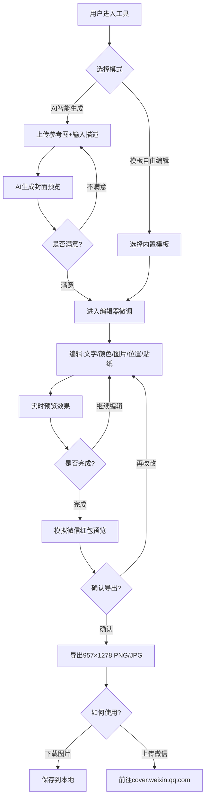

# 产品需求文档：微信红包封面制作工具

**文档版本**: 1.0
**创建日期**: 2025-01-31
**产品状态**: 规划中
**父项目**: PRD-001 v1.2（Lee's Online 个人主页）
**文档作者**: Lee

---

## 1. 综述 (Overview)

### 1.1 产品定位

微信红包封面制作工具是一个独立的在线设计工具，帮助用户快速制作符合微信规范的个性化红包封面。提供 AI 智能生成和模板自由编辑两种模式，满足不同用户群体的需求。

### 1.2 核心业务流程 / 用户旅程地图

1.  **阶段一：选择模式** - 用户进入首页，选择 AI生成 或 模板编辑
2.  **阶段二：创作内容** - 使用 AI 生成或基于模板进行编辑
3.  **阶段三：微调优化** - 在编辑器中调整文字、颜色、位置等细节
4.  **阶段四：预览确认** - 模拟微信红包效果，确认最终效果
5.  **阶段五：导出使用** - 下载符合规范的图片或跳转微信上传

### 1.3 Mermaid 图（核心流程）



---

## 2. 用户故事详述 (User Stories)

### 阶段一：选择模式

---

#### **US-01: 作为用户，我希望进入工具后能选择制作方式，以便根据我的需求选择最合适的创作路径。**

*   **价值陈述 (Value Statement)**:
    *   **作为** 用户
    *   **我希望** 进入工具后能选择 AI生成 或 模板编辑
    *   **以便于** 快速开始创作，无需复杂学习

*   **业务规则与逻辑 (Business Logic)**:
    1.  **前置条件**: 用户访问工具首页
    2.  **首页布局**:
        - 顶部导航：品牌标识 + 主题切换
        - 中部：两种模式选择卡片并排展示
        - 底部：规范提示栏（尺寸/格式/安全边距）
    3.  **模式卡片内容**:
        - **AI智能生成**: 图标 + 标题 + 描述"上传参考图+描述，AI一键生成"
        - **模板自由编辑**: 图标 + 标题 + 描述"10+精选模板，自由拖拽编辑"
    4.  **底部提示栏**:
        - 固定显示微信红包封面规范
        - 957×1278px | PNG/JPG ≤500KB | 四周留160px边距

*   **验收标准 (Acceptance Criteria)**:
    *   **场景1: 进入首页**
        *   **GIVEN** 用户访问工具
        *   **WHEN** 页面加载完成
        *   **THEN** 显示两种模式选择卡片
    *   **场景2: 选择AI生成**
        *   **GIVEN** 用户在首页
        *   **WHEN** 点击"AI智能生成"卡片
        *   **THEN** 跳转至 AI生成页面
    *   **场景3: 选择模板编辑**
        *   **GIVEN** 用户在首页
        *   **WHEN** 点击"模板自由编辑"卡片
        *   **THEN** 跳转至模板选择页面

*   **页面布局线框图 (ASCII Wireframe)**:
    ```
    ┌─────────────────────────────────────────────────────────────────┐
    │  [← 返回Lee's Online]    红包封面制作工具      [☀ 浅色 ]          │
    ├─────────────────────────────────────────────────────────────────┤
    │                                                                 │
    │                    // 微信红包封面制作                          │
    │                                                                 │
    │         ┌──────────────────┐      ┌──────────────────┐         │
    │         │                  │      │                  │         │
    │         │   [✨ AI图标]     │      │  [🎨 编辑图标]   │         │
    │         │                  │      │                  │         │
    │         │   AI 智能生成     │      │  模板自由编辑     │         │
    │         │                  │      │                  │         │
    │         │  上传参考图+描述  │      │  10+精选模板     │         │
    │         │  AI一键生成封面   │      │  自由拖拽编辑    │         │
    │         │                  │      │                  │         │
    │         │   [ 开始使用 ]    │      │   [ 开始使用 ]   │         │
    │         │                  │      │                  │         │
    │         └──────────────────┘      └──────────────────┘         │
    │                                                                 │
    │   ┌─────────────────────────────────────────────────────────┐  │
    │   │  💡 提示：957×1278px | PNG/JPG ≤500KB | 四周留160px边距  │  │
    │   └─────────────────────────────────────────────────────────┘  │
    │                                                                 │
    └─────────────────────────────────────────────────────────────────┘
    ```

---

### 阶段二：创作内容

---

#### **US-02: 作为用户，我希望通过上传参考图和文字描述，让 AI 帮我生成红包封面创意。**

*   **价值陈述 (Value Statement)**:
    *   **作为** 用户
    *   **我希望** 上传参考图并输入描述
    *   **以便于** 快速获得符合我期望的封面设计

*   **业务规则与逻辑 (Business Logic)**:
    1.  **前置条件**: 用户在首页选择"AI智能生成"
    2.  **页面布局**: 单页表单，分三个区块
    3.  **区块一：上传参考图（可选）**:
        - 支持点击上传或拖拽上传
        - 格式：JPG、PNG
        - 大小限制：最大 5MB
        - 显示预览缩略图
        - 支持删除重新上传
    4.  **区块二：文字描述输入**:
        - 多行文本框
        - 占位提示：例如"龙年红包，国潮风格，红色金色配色，有烟花和祥云元素，祝福语写'龙年大吉'..."
        - 字数限制：最多 200 字
        - 显示字数统计
    5.  **区块三：生成按钮与结果**:
        - 生成按钮：点击后显示加载状态
        - AI 生成时间：预计 10-30 秒
        - 结果展示：生成 2-4 张备选图
        - 每张图支持：选择进入编辑、直接下载、重新生成
    6.  **提示信息**:
        - "描述越详细，生成效果越好"
        - 可展开的"描述技巧"提示

*   **验收标准 (Acceptance Criteria)**:
    *   **场景1: 上传参考图**
        *   **GIVEN** 用户在 AI生成页面
        *   **WHEN** 上传 JPG/PNG 图片
        *   **THEN** 显示预览，文件<5MB 通过，>5MB 提示压缩
    *   **场景2: 输入描述**
        *   **GIVEN** 用户在 AI生成页面
        *   **WHEN** 输入描述文字
        *   **THEN** 实时显示字数，超过200字禁止继续输入
    *   **场景3: 生成封面**
        *   **GIVEN** 用户已输入描述
        *   **WHEN** 点击生成按钮
        *   **THEN** 显示加载状态，10-30秒后展示生成结果
    *   **场景4: 选择结果**
        *   **GIVEN** AI已生成结果
        *   **WHEN** 点击"进入编辑器"
        *   **THEN** 跳转编辑器并加载该图片作为背景

*   **页面布局线框图 (ASCII Wireframe)**:
    ```
    ┌─────────────────────────────────────────────────────────────────┐
    │  [← 返回首页]     // AI 智能生成红包封面     [☀ 浅色 ]          │
    ├─────────────────────────────────────────────────────────────────┤
    │                                                                 │
    │  ┌─────────────────────────────────────────────────────────┐   │
    │  │  1. 上传参考图（可选）                                   │   │
    │  │                                                          │   │
    │  │     ┌──────────────────┐                               │   │
    │  │     │                  │                               │   │
    │  │     │   [点击或拖拽     │                               │   │
    │  │     │    上传图片]      │                               │   │
    │  │     │                  │                               │   │
    │  │     │  支持 JPG、PNG   │                               │   │
    │  │     │  最大 5MB        │                               │   │
    │  │     └──────────────────┘                               │   │
    │  │  [✓ 已上传：reference.jpg  2.3MB  [删除]]               │   │
    │  └─────────────────────────────────────────────────────────┘   │
    │                                                                 │
    │  ┌─────────────────────────────────────────────────────────┐   │
    │  │  2. 描述你想要的风格                              0/200 │   │
    │  │                                                          │   │
    │  │  ┌─────────────────────────────────────────────────┐    │   │
    │  │  │ 龙年红包，国潮风格，红色金色配色，有烟花和祥云   │    │   │
    │  │  │ 元素，祝福语写"龙年大吉"...                      │    │   │
    │  │  └─────────────────────────────────────────────────┘    │   │
    │  │                                                          │   │
    │  │  💡 提示：描述越详细，生成效果越好  [查看描述技巧↓]      │   │
    │  └─────────────────────────────────────────────────────────┘   │
    │                                                                 │
    │        [          ✨ 开始生成（预计10-30秒）          ]          │
    │                                                                 │
    │  ┌─────────────────────────────────────────────────────────┐   │
    │  │  3. 生成结果                                             │   │
    │  │                                                          │   │
    │  │     ┌──────────────┐    ┌──────────────┐               │   │
    │  │     │              │    │              │               │   │
    │  │     │   [生成图1]   │    │   [生成图2]   │               │   │
    │  │     │              │    │              │               │   │
    │  │     │ [进入编辑]   │    │ [进入编辑]   │               │   │
    │  │     │ [直接下载]   │    │ [直接下载]   │               │   │
    │  │     └──────────────┘    └──────────────┘               │   │
    │  │                                                          │   │
    │  │           [ 重新生成 ]  [ 换种描述试试 ]                  │   │
    │  └─────────────────────────────────────────────────────────┘   │
    │                                                                 │
    └─────────────────────────────────────────────────────────────────┘
    ```

---

#### **US-03: 作为用户，我希望从精选模板开始编辑，以便快速制作专业美观的红包封面。**

*   **价值陈述 (Value Statement)**:
    *   **作为** 用户
    *   **我希望** 选择内置模板并进行自由编辑
    *   **以便于** 无需设计基础也能制作精美封面

*   **业务规则与逻辑 (Business Logic)**:
    1.  **前置条件**: 用户在首页选择"模板自由编辑"
    2.  **模板选择页面**:
        - 展示 10 套精选模板缩略图
        - 分类标签：全部 / 节日 / 简约 / 可爱 / 商务
        - 悬停显示模板名称和风格描述
        - 点击模板进入编辑器
    3.  **模板内容**:
        - 每套模板包含：背景图、文字样式、装饰元素位置
        - 模板图层结构可编辑
    4.  **编辑器入口**:
        - 选择模板后进入完整编辑器
        - 模板内容加载为可编辑图层

*   **验收标准 (Acceptance Criteria)**:
    *   **场景1: 浏览模板**
        *   **GIVEN** 用户在模板选择页
        *   **WHEN** 页面加载
        *   **THEN** 显示 10 套模板缩略图网格
    *   **场景2: 筛选模板**
        *   **GIVEN** 用户在模板选择页
        *   **WHEN** 点击分类标签
        *   **THEN** 筛选显示对应风格模板
    *   **场景3: 选择模板**
        *   **GIVEN** 用户浏览模板
        *   **WHEN** 点击某模板
        *   **THEN** 进入编辑器并加载该模板

*   **页面布局线框图 (ASCII Wireframe)**:
    ```
    ┌─────────────────────────────────────────────────────────────────┐
    │  [← 返回首页]     // 选择模板开始创作        [☀ 浅色 ]          │
    ├─────────────────────────────────────────────────────────────────┤
    │                                                                 │
    │  [ 全部 ] [ 节日 ] [ 简约 ] [ 可爱 ] [ 商务 ]                     │
    │                                                                 │
    │  ┌──────────┐ ┌──────────┐ ┌──────────┐ ┌──────────┐           │
    │  │          │ │          │ │          │ │          │           │
    │  │ [模板1   │ │ [模板2   │ │ [模板3   │ │ [模板4   │           │
    │  │  预览图] │ │  预览图] │ │  预览图] │ │  预览图] │           │
    │  │          │ │          │ │          │ │          │           │
    │  │ 龙年大吉 │ │ 新年快乐 │ │ 简约商务 │ │ 萌宠可爱 │           │
    │  │ 国潮风格 │ │ 红色喜庆 │ │ 蓝色科技 │ │ 粉色温馨 │           │
    │  └──────────┘ └──────────┘ └──────────┘ └──────────┘           │
    │                                                                 │
    │  ┌──────────┐ ┌──────────┐ ┌──────────┐ ┌──────────┐           │
    │  │          │ │          │ │          │ │          │           │
    │  │ [模板5   │ │ [模板6   │ │ [模板7   │ │ [模板8   │           │
    │  │  预览图] │ │  预览图] │ │  预览图] │ │  预览图] │           │
    │  │          │ │          │ │          │ │          │           │
    │  │ 生日祝福 │ │ 婚礼喜字 │ │ 企业定制 │ │ 个性涂鸦 │           │
    │  │ 温馨粉色 │ │ 金色典雅 │ │ 深色高级 │ │ 彩色活力 │           │
    │  └──────────┘ └──────────┘ └──────────┘ └──────────┘           │
    │                                                                 │
    │  ┌──────────┐ ┌──────────┐                                     │
    │  │          │ │          │                                     │
    │  │ [模板9   │ │ [模板10  │                                     │
    │  │  预览图] │ │  预览图] │                                     │
    │  │          │ │          │                                     │
    │  │ 中秋团圆 │ │ 圣诞欢乐 │                                     │
    │  │ 黄色温暖 │ │ 绿色清新 │                                     │
    │  └──────────┘ └──────────┘                                     │
    │                                                                 │
    └─────────────────────────────────────────────────────────────────┘
    ```

---

### 阶段三：微调优化

---

#### **US-04: 作为用户，我需要在编辑器中对封面进行精细化调整，以达到理想效果。**

*   **价值陈述 (Value Statement)**:
    *   **作为** 用户
    *   **我希望** 在编辑器中调整文字、颜色、图片、位置、贴纸
    *   **以便于** 精确控制封面的每一个细节

*   **业务规则与逻辑 (Business Logic)**:
    1.  **前置条件**: 用户通过 AI生成 或 模板选择 进入编辑器
    2.  **编辑器布局**:
        - **顶部工具栏**: 文件 / 编辑 / 插入 / 视图 / 导出
        - **左侧工具栏**: 文字 / 贴纸 / 上传 / 模板 / 颜色 / AI生成
        - **中央画布**: 957×1278px，显示 160px 虚线安全边距
        - **右侧面板**: 图层管理 + 选中元素属性
    3.  **编辑功能详解**:
        - **改文字**: 双击画布文字直接编辑，或右侧面板修改
          - 限制：最多12个汉字
          - 属性：字体、大小、颜色、描边、阴影
        - **换颜色**: 颜色选择器支持纯色/渐变
          - 可调整：背景色、文字色、元素色
        - **换图片**: 上传图片替换模板中的图片元素
          - 支持裁剪、缩放、旋转
        - **调位置**: 拖拽移动元素
          - 显示 X/Y 坐标
          - 支持键盘方向键微调（1px/10px）
          - 显示对齐辅助线
        - **加贴纸**: 从贴纸库拖拽添加
          - 贴纸库：节日类、装饰类、Emoji类
          - 可调整大小、旋转、透明度
    4.  **图层管理**:
        - 显示所有元素图层列表
        - 支持：显示/隐藏、重命名、锁定、排序（置顶/置底/上移/下移）、删除
    5.  **画布辅助**:
        - 160px 安全边距虚线框
        - 中心区域标记（红包金额显示位置）
        - 缩放控制（50%-200%）
        - 网格对齐开关

*   **验收标准 (Acceptance Criteria)**:
    *   **场景1: 添加文字**
        *   **GIVEN** 用户在编辑器
        *   **WHEN** 点击左侧"文字"工具，在画布点击
        *   **THEN** 创建可编辑文字元素
    *   **场景2: 编辑文字**
        *   **GIVEN** 用户选中文字元素
        *   **WHEN** 双击或右侧面板修改内容
        *   **THEN** 实时更新，超过12字提示
    *   **场景3: 拖拽位置**
        *   **GIVEN** 用户选中元素
        *   **WHEN** 拖拽移动
        *   **THEN** 实时显示位置坐标，接近对齐时显示辅助线
    *   **场景4: 调整颜色**
        *   **GIVEN** 用户选中元素
        *   **WHEN** 右侧面板选择颜色
        *   **THEN** 实时更新元素颜色
    *   **场景5: 图层管理**
        *   **GIVEN** 用户有多个元素
        *   **WHEN** 右侧面板拖拽调整图层顺序
        *   **THEN** 画布层叠顺序相应变化
    *   **场景6: 安全边距提示**
        *   **GIVEN** 用户在编辑器
        *   **WHEN** 元素超出 160px 安全边距
        *   **THEN** 元素变红或显示警告提示

*   **页面布局线框图 (ASCII Wireframe)**:
    ```
    ┌─────────────────────────────────────────────────────────────────┐
    │  文件    编辑    插入    视图    导出                           │
    │  └──────┴──────┴──────┴──────┴──────────────────────────────┘  │
    ├──────────┬──────────────────────────────────────────┬──────────┤
    │          │                                          │  图层管理  │
    │  [文字]   │                                          │  ┌──────┐ │
    │   T      │    ╔══════════════════════════════╗     │  │🔒背景 │ │
    │          │    ║  ← 160px 安全边距           ║     │  │ 文字1 │ │
    │  [贴纸]   │    ║                              ║     │  │ 贴纸2 │ │
    │   🎨     │    ║    ┌────────────────────┐    ║     │  │[选中] │ │
    │          │    ║    │   [红包金额        │    ║     │  └──────┘ │
    │  [上传]   │    ║    │    ¥888.88]       │    ║     │          │
    │   📁     │    ║    │                    │    ║     │  文字属性  │
    │          │    ║    │  [祝福语文字✏️]    │    ║     │          │
    │  [模板]   │    ║    │                    │    ║     │  内容     │
    │   📋     │    ║    │    [装饰元素]      │    ║     │ [恭喜发  │
    │          │    ║    │         ↕ 选中     │    ║     │  财...]  │
    │  [颜色]   │    ║    └────────────────────┘    ║     │          │
    │   🎨     │    ║                              ║     │  字体     │
    │          │    ║  安全边距 160px →           ║     │ [ 微软雅黑│
    │  [AI生成] │    ╚══════════════════════════════╝     │  24px ]  │
    │   ✨     │                                          │          │
    │          │    缩放: [50%] [100%] [150%] [200%]      │  颜色     │
    │ ─────────┤                                          │ [🔴#FF00 │
    │          │    ┌──┬──┬──┬──┬──┬──┐                   │  00]    │
    │  贴纸库   │    │🧧│🎉│🎊│🐉│⭐│❤️│  ← 拖拽到画布   │          │
    │ ┌──────┐ │    └──┴──┴──┴──┴──┴──┘                   │  位置     │
    │ │🎆 烟花│ │                                          │  X: 120  │
    │ │🧨 鞭炮│ │                                          │  Y: 450  │
    │ │🌸 樱花│ │                                          │          │
    │ └──────┘ │                                          │ [删除]   │
    │ [更多...]│                                          │ [置顶]   │
    │          │                                          │ [置底]   │
    └──────────┴──────────────────────────────────────────┴──────────┘
    ```

---

### 阶段四：预览确认

---

#### **US-05: 作为用户，我希望预览红包在微信中的实际显示效果，以确保最终效果符合预期。**

*   **价值陈述 (Value Statement)**:
    *   **作为** 用户
    *   **我希望** 预览红包在微信中的显示效果
    *   **以便于** 确认最终效果，避免上传后发现不满意

*   **业务规则与逻辑 (Business Logic)**:
    1.  **前置条件**: 用户在编辑器完成设计
    2.  **预览模式**:
        - 模拟微信红包打开动画
        - 显示：红包封面图 + 红包金额区域 + 祝福语
        - 提供"领取红包"按钮模拟真实场景
    3.  **预览选项**:
        - 默认预览（显示金额 ¥888.88）
        - 自定义金额预览
        - 无金额预览（仅看封面）
    4.  **对比模式**:
        - 左右对比：设计稿 vs 实际效果
        - 高亮显示可能被裁切或遮挡的区域

*   **验收标准 (Acceptance Criteria)**:
    *   **场景1: 打开预览**
        *   **GIVEN** 用户在编辑器
        *   **WHEN** 点击"预览"按钮
        *   **THEN** 弹出预览窗口，模拟微信红包效果
    *   **场景2: 切换预览模式**
        *   **GIVEN** 用户在预览模式
        *   **WHEN** 切换金额/无金额模式
        *   **THEN** 实时更新预览效果
    *   **场景3: 发现问题**
        *   **GIVEN** 预览发现元素被遮挡
        *   **WHEN** 点击"返回编辑"
        *   **THEN** 回到编辑器，高亮问题元素

*   **页面布局线框图 (ASCII Wireframe)**:
    ```
    ┌─────────────────────────────────────────────────────────────────┐
    │                      [ 遮罩层 ]                                  │
    │                                                                  │
    │    ┌──────────────────────────────────────────────────────┐    │
    │    │  // 微信红包预览                           [ × ]    │    │
    │    │                                                      │    │
    │    │     [ 设计稿 ]              [ 实际效果 ]             │    │
    │    │     ┌──────────┐            ┌──────────┐            │    │
    │    │     │          │            │  ┌────┐  │            │    │
    │    │     │ 封面设计 │            │  │头像│  │            │    │
    │    │     │          │            │  └────┘  │            │    │
    │    │     │          │            │   李**   │            │    │
    │    │     │          │            │         │            │    │
    │    │     │          │            │ 恭喜发财 │            │    │
    │    │     │          │            │ 大吉大利 │            │    │
    │    │     │          │            │         │            │    │
    │    │     │          │            │ ┌─────┐ │            │    │
    │    │     │          │            │ │¥888 │ │            │    │
    │    │     │          │            │ └─────┘ │            │    │
    │    │     │          │            │         │            │    │
    │    │     │          │            │[领取红包]│            │    │
    │    │     └──────────┘            └──────────┘            │    │
    │    │                                                      │    │
    │    │  预览模式: [ 显示金额 ¥888.88 ] [ 自定义 ] [ 仅封面 ] │    │
    │    │                                                      │    │
    │    │         [ 返回编辑 ]      [ 确认导出 ]               │    │
    │    │                                                      │    │
    │    └──────────────────────────────────────────────────────┘    │
    │                                                                  │
    └─────────────────────────────────────────────────────────────────┘
    ```

---

### 阶段五：导出使用

---

#### **US-06: 作为用户，我希望导出符合微信规范的图片，并了解如何上传到微信平台。**

*   **价值陈述 (Value Statement)**:
    *   **作为** 用户
    *   **我希望** 导出符合规范的图片并了解上传流程
    *   **以便于** 将封面应用到微信中

*   **业务规则与逻辑 (Business Logic)**:
    1.  **前置条件**: 用户完成设计并通过预览
    2.  **导出功能**:
        - 格式：PNG（默认）、JPG
        - 尺寸：957×1278px（固定）
        - 大小：自动压缩至 ≤500KB
        - 质量选项：高/中/低（影响文件大小）
    3.  **导出后选项**:
        - 直接下载图片
        - 前往微信红包封面开放平台上传
        - 查看"自动上传"技术方案说明
    4.  **微信上传指引**:
        - 步骤说明：注册账号 → 提交审核 → 支付费用 → 发放封面
        - 审核要求提示（版权、内容规范）
        - 常见问题 FAQ
    5.  **自动上传方案（技术储备）**:
        - 提供 OAuth2 接入微信开放平台的技术文档
        - 说明需要申请的能力：封面平台 API 权限
        - 流程图：用户授权 → 获取 Token → 上传图片 → 提交审核

*   **验收标准 (Acceptance Criteria)**:
    *   **场景1: 导出图片**
        *   **GIVEN** 用户点击导出
        *   **WHEN** 选择格式和质量
        *   **THEN** 下载 957×1278px、≤500KB 的图片
    *   **场景2: 文件过大处理**
        *   **GIVEN** 导出文件 >500KB
        *   **WHEN** 用户选择导出
        *   **THEN** 自动压缩或提示调整质量
    *   **场景3: 查看上传指引**
        *   **GIVEN** 用户导出完成
        *   **WHEN** 点击"如何上传到微信"
        *   **THEN** 显示详细步骤说明
    *   **场景4: 自动上传方案**
        *   **GIVEN** 用户查看上传指引
        *   **WHEN** 点击"自动上传技术方案"
        *   **THEN** 展开 OAuth 接入流程文档

*   **页面布局线框图 (ASCII Wireframe)**:
    ```
    ┌─────────────────────────────────────────────────────────────────┐
    │  [← 返回首页]     // 导出红包封面            [☀ 浅色 ]          │
    ├─────────────────────────────────────────────────────────────────┤
    │                                                                 │
    │  ┌─────────────────────────────────────────────────────────┐   │
    │  │  1. 导出设置                                             │   │
    │  │                                                          │   │
    │  │  格式:  [ PNG ● ] [ JPG ○ ]                              │   │
    │  │                                                          │   │
    │  │  质量:  [ 高（文件较大） ○ ]                             │   │
    │  │         [ 中（推荐）    ● ]                              │   │
    │  │         [ 低（最小）    ○ ]                              │   │
    │  │                                                          │   │
    │  │  预计文件大小: 约 320KB ✓ 符合微信规范                   │   │
    │  │                                                          │   │
    │  │         [      下载图片      ]                           │   │
    │  └─────────────────────────────────────────────────────────┘   │
    │                                                                 │
    │  ┌─────────────────────────────────────────────────────────┐   │
    │  │  2. 上传到微信                                           │   │
    │  │                                                          │   │
    │  │  方式一：手动上传（当前推荐）                            │   │
    │  │  1. 访问 cover.weixin.qq.com                             │   │
    │  │  2. 注册/登录账号                                         │   │
    │  │  3. 点击"定制封面" → 上传图片                            │   │
    │  │  4. 填写封面信息，提交审核                                │   │
    │  │  5. 审核通过后支付费用（1元/个）                          │   │
    │  │                                                          │   │
    │  │  [ 前往微信红包封面平台 → ]                              │   │
    │  │                                                          │   │
    │  │  ─────────────────────────────────────────────────────   │   │
    │  │                                                          │   │
    │  │  方式二：自动上传（技术方案）▼                           │   │
    │  │  通过 OAuth2 接入微信开放平台，实现一键上传...            │   │
    │  │  • 需申请封面平台 API 权限                               │   │
    │  │  • 用户授权流程...                                       │   │
    │  │  • 技术实现文档...                                       │   │
    │  │                                                          │   │
    │  │  [ 查看完整技术方案 ]                                    │   │
    │  └─────────────────────────────────────────────────────────┘   │
    │                                                                 │
    └─────────────────────────────────────────────────────────────────┘
    ```

---

## 3. 数据结构

### 3.1 项目配置

```typescript
// 红包封面项目配置
interface RedPacketProject {
  id: string;                    // 项目唯一ID
  name: string;                  // 项目名称
  createdAt: number;             // 创建时间戳
  updatedAt: number;             // 更新时间戳
  version: string;               // 项目文件版本
  canvas: {
    width: 957;                  // 固定宽度
    height: 1278;                // 固定高度
    backgroundColor: string;     // 背景色
  };
  layers: Layer[];               // 图层数组
  history: HistoryState[];       // 操作历史（用于撤销）
}

// 图层类型
interface Layer {
  id: string;
  type: 'text' | 'image' | 'shape' | 'sticker';
  name: string;
  visible: boolean;
  locked: boolean;
  x: number;                     // 位置 X
  y: number;                     // 位置 Y
  width: number;
  height: number;
  rotation: number;              // 旋转角度
  opacity: number;               // 透明度 0-1
  data: TextData | ImageData | ShapeData | StickerData;
}

// 文字图层数据
interface TextData {
  content: string;               // 内容（最多12字）
  fontFamily: string;
  fontSize: number;
  color: string;
  strokeColor?: string;          // 描边色
  strokeWidth?: number;          // 描边宽
  shadowColor?: string;          // 阴影色
  shadowBlur?: number;           // 阴影模糊
  textAlign: 'left' | 'center' | 'right';
}

// 图片图层数据
interface ImageData {
  src: string;                   // base64 或 URL
  originalSrc: string;           // 原始图片（用于重新裁剪）
  crop?: {
    x: number;
    y: number;
    width: number;
    height: number;
  };
}

// 形状图层数据
interface ShapeData {
  shapeType: 'rect' | 'circle' | 'line';
  fillColor: string;
  strokeColor?: string;
  strokeWidth?: number;
}

// 贴纸图层数据
interface StickerData {
  stickerId: string;             // 贴纸库ID
  category: 'festival' | 'decoration' | 'emoji';
}

// 操作历史
interface HistoryState {
  timestamp: number;
  action: string;                // 操作描述
  layers: Layer[];               // 图层状态快照
}
```

### 3.2 模板配置

```typescript
// 模板配置
interface Template {
  id: string;
  name: string;
  category: 'festival' | 'simple' | 'cute' | 'business';
  thumbnail: string;             // 缩略图 URL
  preview: string;               // 预览图 URL
  project: RedPacketProject;     // 完整的项目数据
}

// 内置模板列表
const builtInTemplates: Template[] = [
  { id: 't1', name: '龙年大吉', category: 'festival', ... },
  { id: 't2', name: '新年快乐', category: 'festival', ... },
  { id: 't3', name: '简约商务', category: 'business', ... },
  { id: 't4', name: '萌宠可爱', category: 'cute', ... },
  // ... 共10套
];
```

### 3.3 贴纸库配置

```typescript
// 贴纸配置
interface Sticker {
  id: string;
  name: string;
  category: 'festival' | 'decoration' | 'emoji';
  src: string;                   // SVG 或 PNG
  tags: string[];                // 搜索标签
}

// 贴纸库
const stickerLibrary: Sticker[] = [
  // 节日类
  { id: 's1', name: '烟花', category: 'festival', src: '...', tags: ['新年', '庆祝'] },
  { id: 's2', name: '灯笼', category: 'festival', src: '...', tags: ['春节', '传统'] },
  { id: 's3', name: '鞭炮', category: 'festival', src: '...', tags: ['新年', '喜庆'] },
  // 装饰类
  { id: 's10', name: '祥云', category: 'decoration', src: '...', tags: ['国潮', '传统'] },
  { id: 's11', name: '边框', category: 'decoration', src: '...', tags: ['简约', '优雅'] },
  // Emoji类
  { id: 's20', name: '爱心', category: 'emoji', src: '...', tags: ['爱情', '喜欢'] },
  { id: 's21', name: '星星', category: 'emoji', src: '...', tags: ['闪耀', '优秀'] },
  // ...
];
```

---

## 4. 存储策略

### 4.1 自动保存

- **保存位置**: localStorage
- **保存间隔**: 30 秒
- **存储键名**: `redpacket_project_{projectId}`
- **数据格式**: JSON 序列化的 RedPacketProject

### 4.2 手动导出/导入

- **导出格式**: JSON 文件
- **文件名**: `红包封面_{项目名称}_{时间戳}.json`
- **导入方式**: 文件选择器读取 JSON
- **兼容性检查**: 导入时检查版本号，不兼容时提示

### 4.3 存储限制处理

```typescript
// 检查 localStorage 空间
function checkStorageLimit(): boolean {
  const limit = 5 * 1024 * 1024; // 5MB 估算
  let total = 0;
  for (let key in localStorage) {
    if (key.startsWith('redpacket_project_')) {
      total += localStorage[key].length;
    }
  }
  return total < limit * 0.9; // 90% 阈值
}

// 清理旧项目
function cleanupOldProjects(): void {
  const projects = getAllProjects();
  // 按时间排序，删除最旧的
  // 或提示用户手动清理
}
```

---

## 5. 技术实现要点

### 5.1 画布渲染

- 使用 HTML5 Canvas API 或 Fabric.js 进行渲染
- 离屏渲染优化性能
- 分层渲染：背景层 → 图片层 → 形状层 → 文字层

### 5.2 导出图片

```typescript
// 导出 Canvas 为图片
function exportCanvas(canvas: HTMLCanvasElement, format: 'png' | 'jpg', quality: number): string {
  return canvas.toDataURL(`image/${format}`, quality);
}

// 压缩图片至 ≤500KB
async function compressImage(dataUrl: string, maxSize: number = 500 * 1024): Promise<string> {
  // 二分法调整 quality 直到文件大小符合要求
  let quality = 0.9;
  let result = dataUrl;

  while (result.length > maxSize && quality > 0.1) {
    quality -= 0.1;
    result = canvas.toDataURL('image/jpeg', quality);
  }

  return result;
}
```

### 5.3 AI 生成集成

- 调用 AI 绘图 API（如 DALL-E、Midjourney API、Stable Diffusion 等）
- 参数映射：用户描述 → AI prompt
- 结果缓存：生成的图片 URL 临时缓存

---

## 6. 非功能需求 (Non-Functional Requirements)

### 6.1 性能要求

- **首屏加载**: < 2s
- **编辑器交互**: 拖拽/缩放 60fps
- **导出速度**: < 3s
- **AI 生成**: 10-30s（显示进度条）

### 6.2 兼容性

- **浏览器**: Chrome 90+, Edge 90+, Firefox 88+, Safari 14+
- **移动端**: 支持平板编辑，手机端仅预览
- **降级处理**: 不支持 Canvas 的浏览器显示提示

### 6.3 可访问性

- 键盘操作支持（Tab 切换、方向键微调）
- ARIA 标签
- 高对比度模式

---

## 7. 开发任务清单

- [ ] **US-01**: 模式选择页面
  - [ ] 首页布局（双卡片 + 底部提示）
  - [ ] 主题切换
  - [ ] 返回 Lee's Online 链接

- [ ] **US-02**: AI 智能生成
  - [ ] 参考图上传组件（拖拽+点击）
  - [ ] 文字描述输入框（字数限制）
  - [ ] AI 生成调用与加载状态
  - [ ] 结果展示（2-4张备选）
  - [ ] 进入编辑器/直接下载选项

- [ ] **US-03**: 模板选择
  - [ ] 模板网格展示
  - [ ] 分类筛选标签
  - [ ] 模板加载入编辑器

- [ ] **US-04**: 编辑器核心
  - [ ] Canvas 画布（957×1278 + 160px安全边距线）
  - [ ] 顶部工具栏
  - [ ] 左侧工具栏（文字/贴纸/上传/模板/颜色/AI）
  - [ ] 右侧面板（图层管理 + 属性编辑）
  - [ ] 文字编辑功能（内容/字体/大小/颜色/描边/阴影）
  - [ ] 颜色编辑功能（纯色/渐变选择器）
  - [ ] 图片编辑功能（上传/裁剪/缩放/旋转）
  - [ ] 位置调整功能（拖拽/键盘微调/对齐辅助线）
  - [ ] 贴纸库功能（拖拽添加/大小旋转/透明度）
  - [ ] 图层管理（显示/隐藏/锁定/排序/删除/重命名）

- [ ] **US-05**: 预览功能
  - [ ] 微信红包模拟预览
  - [ ] 金额/无金额模式切换
  - [ ] 左右对比视图
  - [ ] 问题区域高亮

- [ ] **US-06**: 导出与上传
  - [ ] 导出设置（PNG/JPG + 质量选项）
  - [ ] 自动压缩至 ≤500KB
  - [ ] 下载功能
  - [ ] 微信上传指引页面
  - [ ] 自动上传技术方案文档

- [ ] **存储功能**
  - [ ] localStorage 自动保存（30秒间隔）
  - [ ] JSON 导出/导入
  - [ ] 存储空间管理

- [ ] **素材准备**
  - [ ] 设计 10 套精选模板
  - [ ] 准备贴纸库（节日/装饰/Emoji）

---

## 8. 附录

### 8.1 微信红包封面规范速查

| 项目 | 规格 |
|------|------|
| 尺寸 | 957px × 1278px |
| 格式 | PNG / JPG |
| 大小 | ≤ 500KB |
| 安全边距 | 四周 160px |
| 文字限制 | 最多 12 个汉字 |

### 8.2 外部链接

- 微信红包封面开放平台: https://cover.weixin.qq.com
- Lee's Online 主页: https://lee-online.com

---

**PRD 版本历史**

| 版本 | 日期 | 变更内容 |
|------|------|----------|
| v1.0 | 2025-01-31 | 初始版本，从 PRD-001 v1.2 剥离独立 |
